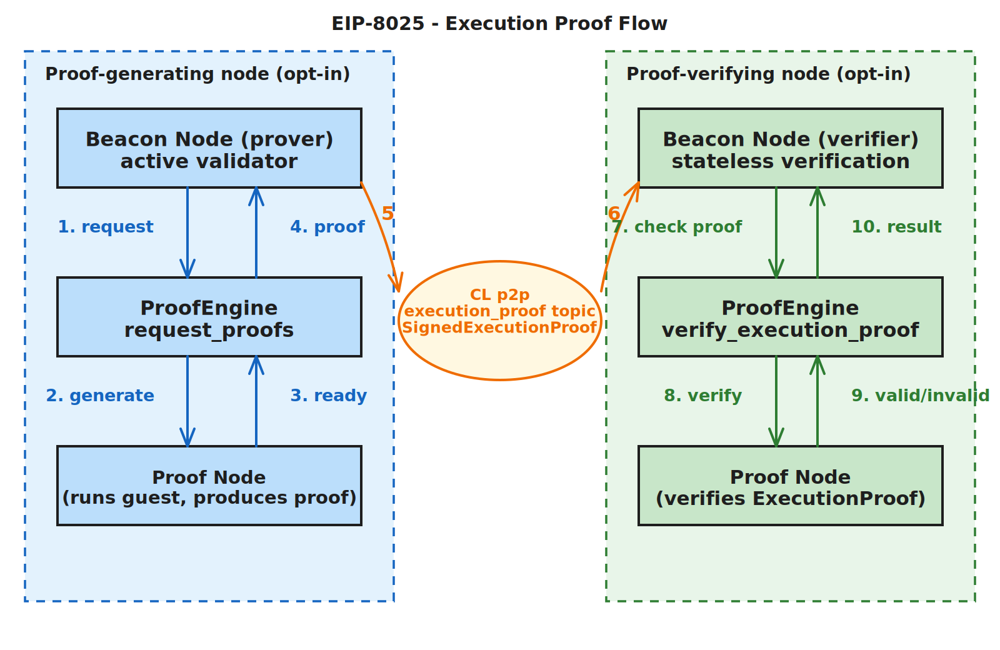
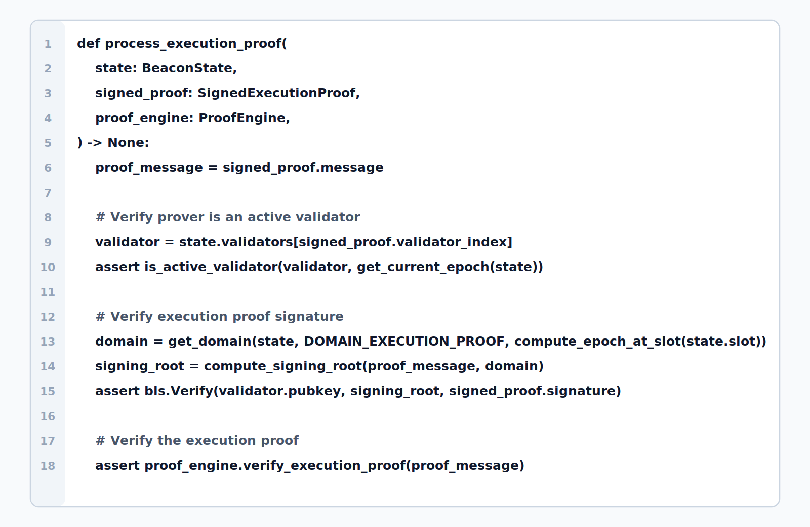
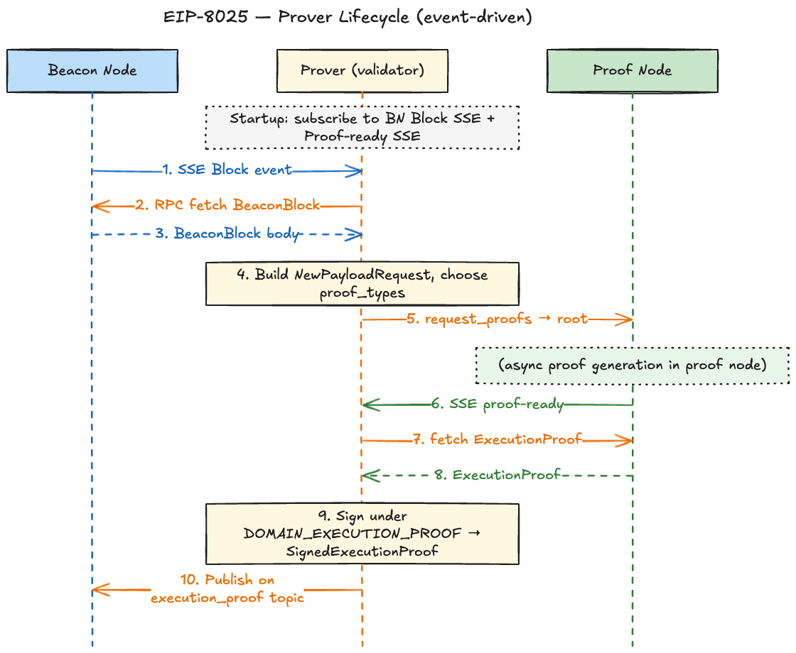
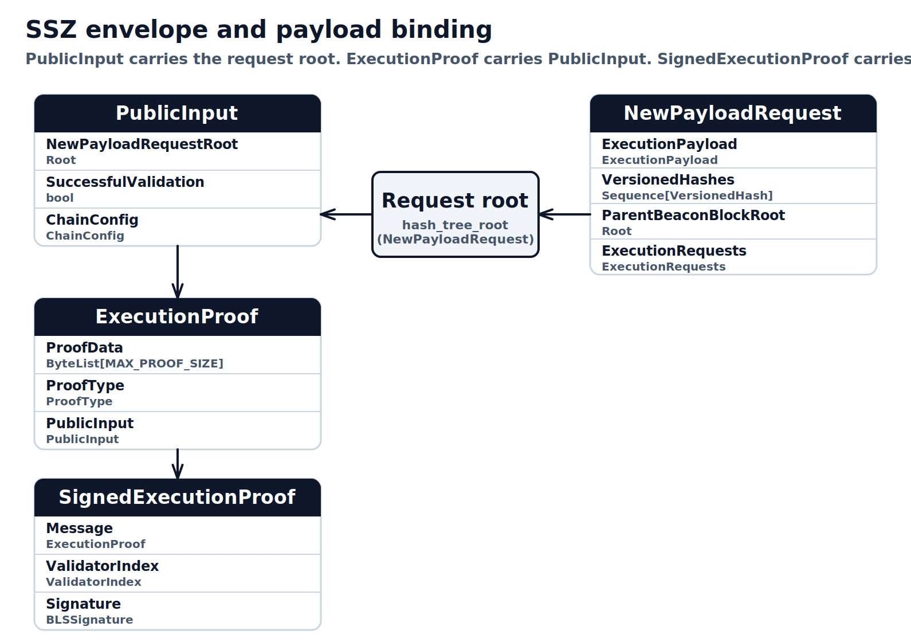
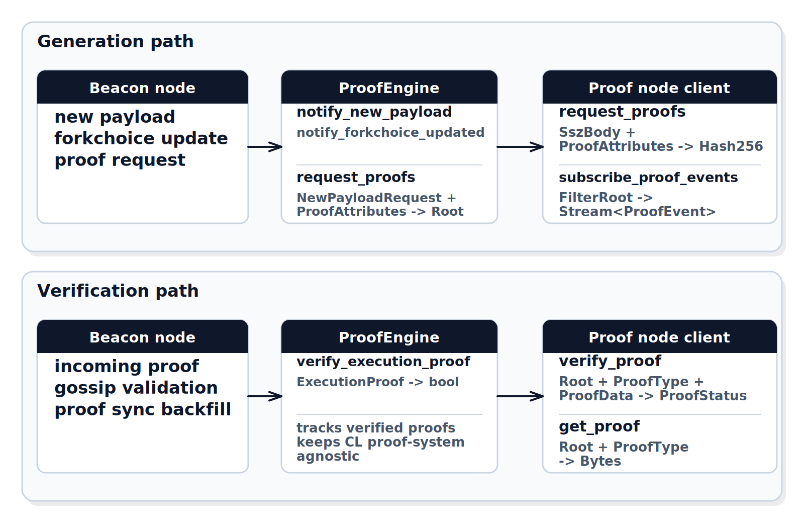
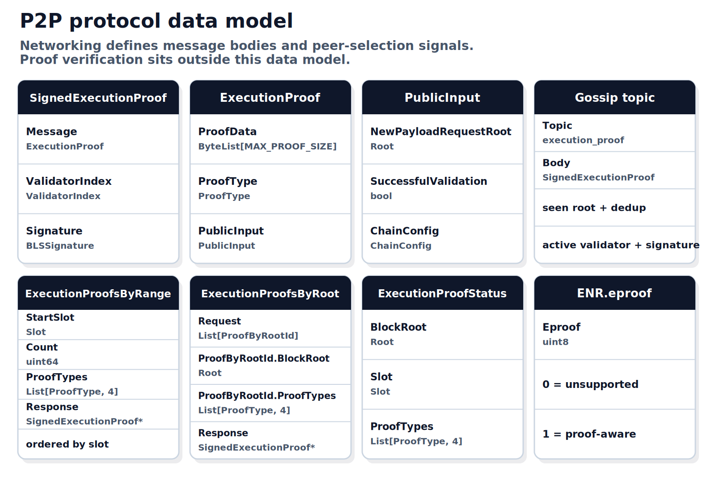
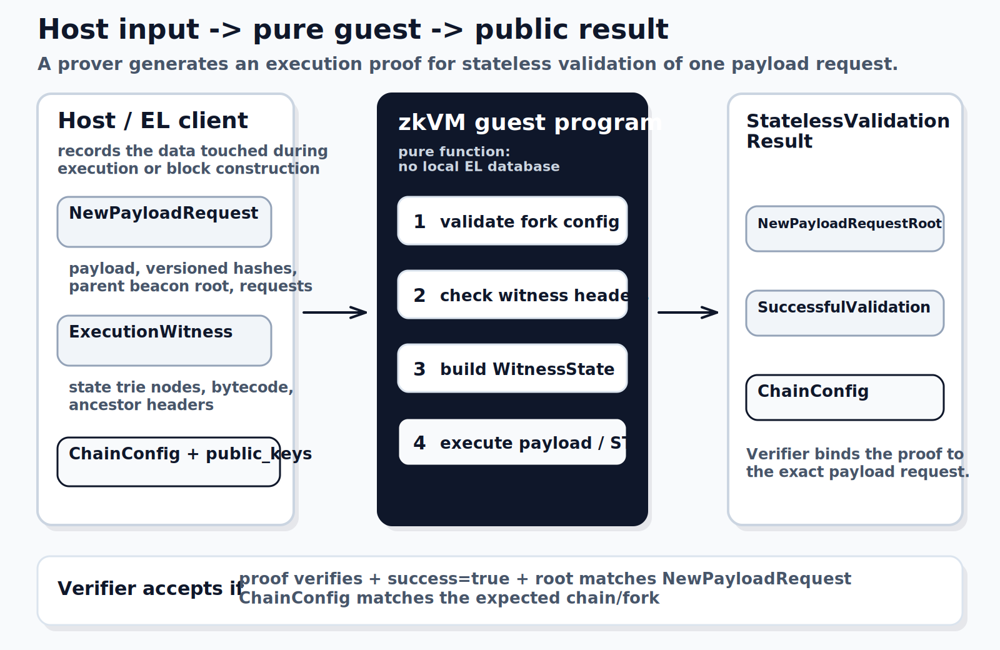
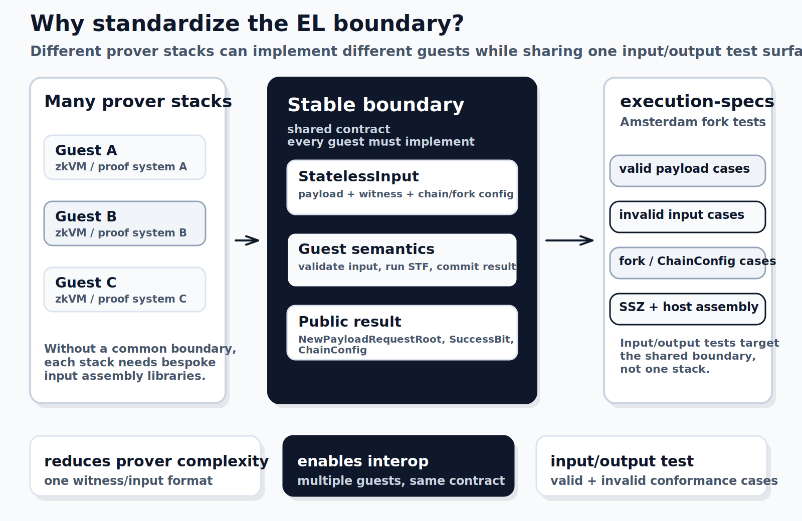

<!-- _class: opening-card -->

Optional execution proofs01 / 11

# Optional execution proofs

EIP-8025 lets Ethereum clients verify payloads using execution proofs. Execution proof verification takes constant time and does not require the EL state.

$$
\begin{array}{l}
\textbf{Validation bottleneck:}\ \text{payload validity currently requires re-execution} \\
\textbf{Execution proofs:}\ \text{give constant-time payload verification} \\
\textbf{Stateless validation:}\ \text{no EL state is needed to check the proof}
\end{array}
$$

  
<strong>Payload validation path</strong>Same block, different check

  

    
Today

    
<strong>Block import</strong>

    

    
<strong>Re-execute payload</strong>

    

    
<strong>Payload validity</strong>

  

  

    
EIP-8025

    
<strong>Block import</strong>

    

    
<strong>Verify proof</strong>

    

    
<strong>Stateless payload validity</strong>

  

  

    
No EL state

    
Constant-time check

    
Payload validity proof

  

EIP-8025

---

<!-- _class: flow-card -->

Execution proof flow02 / 11

# Execution proof flow

When a valid block is imported, a prover asks the proof engine for an execution proof, signs the proof, and publishes it to the network. Verifiers use the proof to check payload validity.

$$
\begin{array}{l}
\textbf{Block import:}\ \text{creates one payload proof request} \\
\textbf{Prover:}\ \text{generates, signs, and publishes a SignedExecutionProof} \\
\textbf{Verifier:}\ \text{checks payload validity by verifying that proof}
\end{array}
$$

  

EIP-8025

---

<!-- _class: hooks-card -->

Consensus specs modifications03 / 11

# Consensus specs modifications

A small set of changes to the consensus specs is required to integrate execution proofs.

$$
\begin{array}{l}
\textbf{Active validator:}\ \text{validator index resolves to an active validator} \\
\textbf{Domain signature:}\ \text{the proof is signed by the active validator using the execution proof domain} \\
\textbf{Payload validity:}\ \text{ProofEngine verifies the execution proof instead of re-executing the payload}
\end{array}
$$

  

EIP-8025

---

<!-- _class: lifecycle-card -->

Proof generation lifecycle04 / 11

# Proof generation lifecycle

A prover watches block events, builds the payload request, asks the proof node to prove it, signs the proof, and gossips it to the network.

  

EIP-8025

---

<!-- _class: ssz-card -->

Proof types05 / 11

# Proof types

EIP-8025 introduces consensus-layer data types for execution proof verification, signing, and network transport.

$$
\begin{array}{l}
\textbf{PublicInput:}\ \text{binds verification to the exact payload request root} \\
\textbf{ExecutionProof:}\ \text{carries proof type, proof data, and public input} \\
\textbf{SignedExecutionProof:}\ \text{adds validator index and signature}
\end{array}
$$

  

EIP-8025

---

<!-- _class: engine-card -->

The Proof Engine06 / 11

# The Proof Engine

A proof engine is introduced to abstract execution proof generation, verification, and state tracking from the consensus layer.

$$
\begin{array}{l}
\textbf{CL side:}\ \text{notify payload and forkchoice events, request proofs, verify proofs} \\
\textbf{ProofEngine:}\ \text{hides proof-system implementation and storage} \\
\textbf{Root binding:}\ \text{request id matches the PublicInput payload root}
\end{array}
$$

  

EIP-8025

---

<!-- _class: p2p-card -->

Execution proof networking07 / 11

# Execution proof networking

EIP-8025 adds one proof gossip topic, two proof-sync protocols, a status handshake, and an ENR flag. Gossip and sync carry signed proofs; discovery and status choose peers.

$$
\begin{array}{l}
\textbf{Network object:}\ \text{SignedExecutionProof carries validator index, signature, and proof} \\
\textbf{Sync protocols:}\ \text{ByRange is slot-based; ByRoot is selector-based} \\
\textbf{Peer selection:}\ \text{ENR.eproof advertises capability; status returns block root, slot, and proof types}
\end{array}
$$

  

EIP-8025

---

<!-- _class: el-card -->

The guest program08 / 11

# The guest program

The execution proof guest program performs stateless validation for one Engine API payload request.

$$
\begin{array}{l}
\textbf{Host:}\ \text{builds StatelessInput from payload request, witness, and chain config} \\
\textbf{Guest:}\ \text{runs stateless new-payload validation with no local EL database} \\
\textbf{Output:}\ \text{StatelessValidationResult is the public result}
\end{array}
$$

  

EIP-8025

---

<!-- _class: el-card -->

Guest input standards09 / 11

# Guest input standards

Standardizing StatelessInput and StatelessValidationResult gives every prover stack the same input/output test surface.

$$
\begin{array}{l}
\textbf{Input:}\ \text{multiple guests and provers share StatelessInput} \\
\textbf{Output:}\ \text{all implementations return StatelessValidationResult} \\
\textbf{Test I/O:}\ \text{same input contract, same result contract, same cases}
\end{array}
$$

  

EIP-8025

---

<!-- _class: terms-card -->

Terminology10 / 11

# Terminology

$$
\begin{array}{l}
\textbf{Proof system:}\ \text{proves that a computation was performed correctly} \\
\textbf{Execution proof:}\ \text{proves stateless validation for one NewPayloadRequest} \\
\textbf{Prover:}\ \text{runs execution validation and generates an execution proof} \\
\textbf{Verifier:}\ \text{checks an execution proof instead of re-executing the payload} \\
\textbf{Guest:}\ \text{the program whose execution is proven} \\
\textbf{Host:}\ \text{prepares input, runs the guest, and packages the proof} \\
\textbf{Private input:}\ \text{serialized StatelessInput, including the execution witness} \\
\textbf{Execution Witness:}\ \text{data used by the guest without verifier EL state} \\
\textbf{Public input:}\ \text{binds NewPayloadRequest, chain configuration, and validation result} \\
\textbf{Proof node:}\ \text{external service that performs proof generation work} \\
\textbf{Proof engine:}\ \text{consensus-client interface to proof generation and verification} \\
\textbf{Proof-aware peer:}\ \text{advertises support and participates for supported proof types} \\
\textbf{Server-Sent Events (SSE):}\ \text{long-lived streams for block and proof-completion events}
\end{array}
$$

EIP-8025

---

<!-- _class: resources-card -->

Resources11 / 11

# Resources

  <section class="resource-section">
    <h2>Consensus Layer</h2>
    
ACDC proposal deck<a target="_blank" rel="noopener noreferrer" href="https://frisitano.github.io/slides/presentations/eip8025-acdc-proposal-2026-05-14/">frisitano.github.io/slides/presentations/eip8025-acdc-proposal-2026-05-14/</a>

    
EIP<a target="_blank" rel="noopener noreferrer" href="https://eips.ethereum.org/EIPS/eip-8025">eips.ethereum.org/EIPS/eip-8025</a>

    
EIP PR<a target="_blank" rel="noopener noreferrer" href="https://github.com/ethereum/EIPs/pull/11604">github.com/ethereum/EIPs/pull/11604</a>

    
Discussion<a target="_blank" rel="noopener noreferrer" href="https://ethereum-magicians.org/t/eip-8025-optional-execution-proofs/25500">ethereum-magicians.org/t/eip-8025-optional-execution-proofs/25500</a>

    
Consensus specs<a target="_blank" rel="noopener noreferrer" href="https://ethereum.github.io/consensus-specs/specs/_features/eip8025/">ethereum.github.io/consensus-specs/specs/_features/eip8025/</a>

    
Beacon API PR<a target="_blank" rel="noopener noreferrer" href="https://github.com/ethereum/beacon-APIs/pull/569">github.com/ethereum/beacon-APIs/pull/569</a>

    
Lighthouse fork<a target="_blank" rel="noopener noreferrer" href="https://github.com/eth-act/lighthouse">github.com/eth-act/lighthouse</a>

    
Prysm fork<a target="_blank" rel="noopener noreferrer" href="https://github.com/OffchainLabs/prysm/tree/optional-proofs">github.com/OffchainLabs/prysm/tree/optional-proofs</a>

    
Kurtosis package<a target="_blank" rel="noopener noreferrer" href="https://github.com/ethpandaops/ethereum-package">github.com/ethpandaops/ethereum-package</a>

    
Kurtosis configs<a target="_blank" rel="noopener noreferrer" href="https://github.com/ethpandaops/ethereum-package/blob/main/.github/tests/zkboost.yaml">mock proofs</a><a target="_blank" rel="noopener noreferrer" href="https://github.com/ethpandaops/ethereum-package/blob/main/.github/tests/examples/1gpu_zkvm.yaml">1 GPU</a><a target="_blank" rel="noopener noreferrer" href="https://github.com/ethpandaops/ethereum-package/blob/main/.github/tests/examples/8gpu_zkvm.yaml">8 GPU</a>

    
Dora explorer<a target="_blank" rel="noopener noreferrer" href="https://github.com/ethpandaops/dora">github.com/ethpandaops/dora</a>

  </section>

  <section class="resource-section">
    <h2>Execution Layer</h2>
    
Execution specs<a target="_blank" rel="noopener noreferrer" href="https://github.com/ethereum/execution-specs/tree/master/src/ethereum/forks/amsterdam">github.com/ethereum/execution-specs/tree/master/src/ethereum/forks/amsterdam</a>

    
Stateless files<a target="_blank" rel="noopener noreferrer" href="https://github.com/ethereum/execution-specs/blob/85fc20ca5937719a854472a87cb48d01ef1dffca/src/ethereum/forks/amsterdam/stateless.py">stateless.py</a><a target="_blank" rel="noopener noreferrer" href="https://github.com/ethereum/execution-specs/blob/85fc20ca5937719a854472a87cb48d01ef1dffca/src/ethereum/forks/amsterdam/stateless_guest.py">guest.py</a><a target="_blank" rel="noopener noreferrer" href="https://github.com/ethereum/execution-specs/blob/85fc20ca5937719a854472a87cb48d01ef1dffca/src/ethereum/forks/amsterdam/stateless_host.py">host.py</a><a target="_blank" rel="noopener noreferrer" href="https://github.com/ethereum/execution-specs/blob/85fc20ca5937719a854472a87cb48d01ef1dffca/src/ethereum/forks/amsterdam/stateless_host_exec_witness.py">witness.py</a><a target="_blank" rel="noopener noreferrer" href="https://github.com/ethereum/execution-specs/blob/85fc20ca5937719a854472a87cb48d01ef1dffca/src/ethereum/forks/amsterdam/stateless_ssz.py">stateless_ssz.py</a>

    
Conformance tests<a target="_blank" rel="noopener noreferrer" href="https://github.com/ethereum/execution-specs/tree/85fc20ca5937719a854472a87cb48d01ef1dffca/tests/amsterdam/eip8025_optional_proofs">github.com/ethereum/execution-specs/tree/.../eip8025_optional_proofs</a>

    
Execution API PR<a target="_blank" rel="noopener noreferrer" href="https://github.com/ethereum/execution-apis/pull/735">github.com/ethereum/execution-apis/pull/735</a>

    
eth-act repos<a target="_blank" rel="noopener noreferrer" href="https://github.com/eth-act/zkboost">zkboost</a><a target="_blank" rel="noopener noreferrer" href="https://github.com/eth-act/ere">ere</a><a target="_blank" rel="noopener noreferrer" href="https://github.com/eth-act/ere-guests">ere-guests</a>

  </section>

  <section class="resource-section">
    <h2>General</h2>
    
zkEVM hub<a target="_blank" rel="noopener noreferrer" href="https://zkevm.ethereum.foundation/">zkevm.ethereum.foundation/</a>

    
eth-act benchmarks<a target="_blank" rel="noopener noreferrer" href="https://eth-act.github.io/zkevm-benchmark-runs/">eth-act.github.io/zkevm-benchmark-runs/</a>

    
L1 zkEVM breakouts<a target="_blank" rel="noopener noreferrer" href="https://github.com/ethereum/pm/issues?q=is%3Aissue+L1-zkEVM+breakout">github.com/ethereum/pm/issues?q=is%3Aissue+L1-zkEVM+breakout</a>

    
Benchmark profiles<a target="_blank" rel="noopener noreferrer" href="https://eth-act.github.io/zkevm-benchmark-runs/profiles/">eth-act.github.io/zkevm-benchmark-runs/profiles/</a>

    
zkEVM blog<a target="_blank" rel="noopener noreferrer" href="https://zkevm.ethereum.foundation/blog">zkevm.ethereum.foundation/blog</a>

    
EIP-8025 post<a target="_blank" rel="noopener noreferrer" href="https://zkevm.ethereum.foundation/blog/eip-8025-optional-execution-proofs-hegota">zkevm.ethereum.foundation/blog/eip-8025-optional-execution-proofs-hegota</a>

    
zkVM standards<a target="_blank" rel="noopener noreferrer" href="https://zkevm.ethereum.foundation/blog/zkevm-standards-v0-release">zkevm.ethereum.foundation/blog/zkevm-standards-v0-release</a>

    
Ethproofs<a target="_blank" rel="noopener noreferrer" href="https://ethproofs.org/">ethproofs.org/</a>

    
Ethproofs GitHub<a target="_blank" rel="noopener noreferrer" href="https://github.com/ethproofs">github.com/ethproofs</a>

  </section>

EIP-8025

