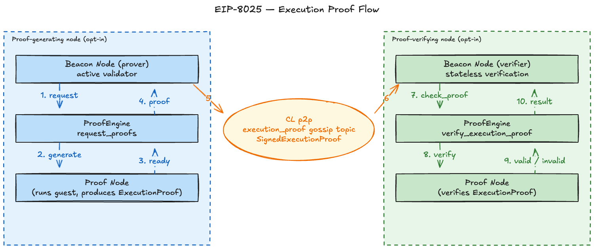

<!-- Slide 1: Title -->
# EIP-8025: Optional Proofs
## Proposal for Inclusion in Hegota

Francesco (@frisitano) / Ignacio (@jsign) — EF zkEVM

**ACDC, May 14, 2026**

---

<style scoped>
img { display: block; margin: 0.6em auto 0; max-width: 100%; max-height: 78vh; }
</style>

<!-- Slide 2: tl;dr -->
### TLDR



---

<style scoped>
li { font-size: 0.75em; }
</style>

<!-- Slide 3: Motivation -->
### Motivation

- **Benefits**
  - Sublinear, stateless validation — node hardware requirements decoupled from gas limit & state size
  - Make block validation accessible — preserving decentralisation even as gas limit and state grow
- **Why "optional"**
  - Mitigates the risk of introducing novel cryptographic technology into the protocol
  - Collect data, optimise, and build operational experience before potentially making proofs mandatory later on
  - Proof verification is not load-bearing on consensus — it sits outside fork choice and the state-transition function

---

<!-- Slide 4: Why in Hegota -->
### Why in Hegota?

- ZK technology has sufficiently matured — proving stacks have been running in production on L2 rollups for years
- First step toward mandatory proofs — better taken early, with time to iterate
- Both CL and EL specs are largely settled
- Both CL and EL have client implementations
- Fully opt-in → low risk for inclusion: validators that don't enable either mode see **no change** in behaviour, bandwidth, or attestation duties

---

<style scoped>
li { font-size: 0.75em; }
</style>

<!-- Slide 5: Consensus Layer -->
### Consensus Layer

- **Two opt-in modes** (a node MAY enable either or both)
  - *Proof-generating*: on receiving a valid block, request a proof and broadcast it on a dedicated gossipsub topic
  - *Proof-verifying*: consume gossiped proofs, verify statelessly
- **Specs:** [consensus-specs](https://github.com/ethereum/consensus-specs/tree/031e521f0a82b0e475ecfc13f79dd251a6284fc2/specs/_features/eip8025)
- **Client implementations:**
  - [eth-act/lighthouse](https://github.com/eth-act/lighthouse)
  - [OffchainLabs/prysm](https://github.com/OffchainLabs/prysm/tree/optional-proofs)
- **E2E devnet:** Lighthouse ↔ Prysm interop with GPU prover complete

---

<style scoped>
pre { font-size: 0.55em; }
p { font-size: 0.75em; }
</style>

<!-- Slide 6: ProofEngine + P2P -->
### ProofEngine + P2P additions

New `ProofEngine` interface, modelled on the Engine API, + gossip type.

```python
class ProofEngine(Protocol):
    def verify_execution_proof(self, proof: ExecutionProof) -> bool: ...
    def notify_new_payload(self, request: NewPayloadRequest) -> None: ...
    def notify_forkchoice_updated(self, head: Hash32, safe: Hash32, finalized: Hash32) -> None: ...
    def request_proofs(self, request: NewPayloadRequest, attrs: ProofAttributes) -> Root: ...
```

```python
# Gossip — `execution_proof` topic
class SignedExecutionProof(Container):
    message: ExecutionProof
    validator_index: ValidatorIndex
    signature: BLSSignature
```

**Req/resp:** `ExecutionProofsByRange` · `ExecutionProofsByRoot` · `ExecutionProofStatus`

**Discovery:** new `eproof` ENR key advertises execution proof support.

---

<style scoped>
li { font-size: 0.75em; }
</style>

<!-- Slide 7: Infrastructure -->
### Infrastructure

- **Infra readiness:** Kurtosis + ethereum-package GPU support landed
- **Observability:** proof latency, sizes, and gossip behaviour measurable on live networks — Grafana dashboards: [zkboost](https://github.com/ethpandaops/ethereum-package/tree/main/static_files/grafana-config/dashboards/zkboost) · [lighthouse](https://github.com/ethpandaops/ethereum-package/tree/main/static_files/grafana-config/dashboards/lighthouse)
- **Block explorer:** execution proofs displayed in [Dora](https://github.com/ethpandaops/dora)
- **Run it:** ethereum-package example configs — [dummy proofs](https://github.com/ethpandaops/ethereum-package/blob/main/.github/tests/zkboost.yaml) · [1-GPU](https://github.com/ethpandaops/ethereum-package/blob/main/.github/tests/examples/1gpu_zkvm.yaml) · [8-GPU](https://github.com/ethpandaops/ethereum-package/blob/main/.github/tests/examples/8gpu_zkvm.yaml)

---

<style scoped>
li { font-size: 0.7em; }
</style>

<!-- Slide 8: Execution Layer -->
### Execution Layer

- Requires two main parts: **`StatelessInput`** and **Guest program** definitions
- **`StatelessInput`**
  - Cryptographically verifiable state required to execute a payload — private input to the guest program
  - Standardised to reduce the complexity of running a prover (single witness format across guest programs)
- **Guest program**
  - Exact statement attested to: EL state-transition function applied to `StatelessInput` + input-validation logic binding the witness to the payload's public commitments
- **Specs and tests** — fully spec'd in `execution-specs` Amsterdam fork
  - [Stateless interfaces](https://github.com/ethereum/execution-specs/blob/85fc20ca5937719a854472a87cb48d01ef1dffca/src/ethereum/forks/amsterdam/stateless.py) · [Guest program](https://github.com/ethereum/execution-specs/blob/85fc20ca5937719a854472a87cb48d01ef1dffca/src/ethereum/forks/amsterdam/stateless_guest.py) · [Host input assembly](https://github.com/ethereum/execution-specs/blob/85fc20ca5937719a854472a87cb48d01ef1dffca/src/ethereum/forks/amsterdam/stateless_host.py) · [SSZ schema](https://github.com/ethereum/execution-specs/blob/85fc20ca5937719a854472a87cb48d01ef1dffca/src/ethereum/forks/amsterdam/stateless_ssz.py)
  - ~163 [conformance tests](https://github.com/ethereum/execution-specs/tree/85fc20ca5937719a854472a87cb48d01ef1dffca/tests/amsterdam/eip8025_optional_proofs) covering valid and invalid cases (more tests still required)
  - [Releases](https://github.com/ethereum/execution-spec-tests/releases?q=zkevm&expanded=true) done on top of latest EL devnet branch

---

<!-- Slide 9: Join the discussion -->
### Join the discussion

- **zkEVM breakout calls:** [ethereum/pm — L1-zkEVM breakouts](https://github.com/ethereum/pm/issues?q=is%3Aissue+L1-zkEVM+breakout)
- **zkEVM team:** [website](https://zkevm.ethereum.foundation/) · [blog](https://zkevm.ethereum.foundation/blog)
- **EthR&D Discord server**
  - [#l1-zkevm](https://discord.com/channels/595666850260713488/1375154553812422736) — zkVM-related discussions
  - [#l1-zkevm-protocol](https://discord.com/channels/595666850260713488/1451216716062523507) — protocol-related discussions
- **EIP discussion:** [ethereum-magicians.org/t/25500](https://ethereum-magicians.org/t/eip-optional-execution-proofs/25500)
