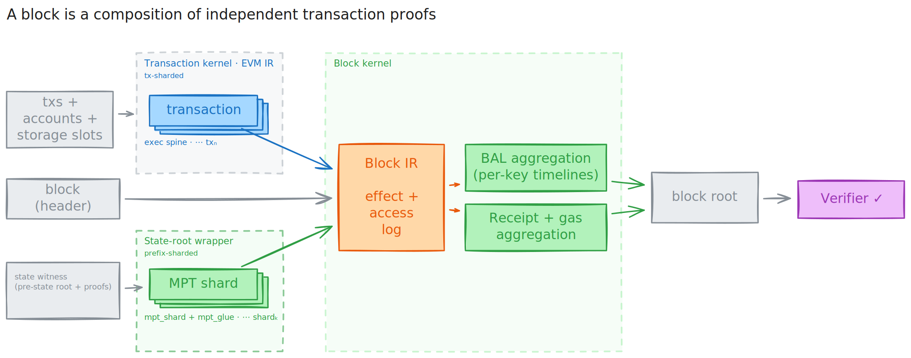

# Proving the EL State Machine

### EL-IR — a state-machine based EL Specification

Francesco Risitano

---

### EL-IR

- The EL is defined as a state machine that transitions using instructions.
- The EVM host is underspecified and only a reference python implementation exists.
- **Two kernels** — **EVM** (per-transaction) ⊕ **Block IR** (per-block)

**Block IR events**

- TxBegin
- TxEnd
- ArithmeticOp
- MemoryExpand
- MemoryRead
- MemoryWrite
- MemoryByteWrite
- CallEnter
- CallExit
- CallResult
- PrecompileCall
- StorageRead
- StorageWrite
- AccountRead
- AccountWrite
- Keccak
- LogEmit
- BalanceTransfer
- GasCharge
- ReceiptEmit

---

### Proof Composition

---

### Stack

- **EL-IR** — obligation spec
- **revm** — execution engine for generating EL-IR traces
- **Clean** — Use clean to satisfy obligations using tables and channels
- **LeanMultisig / WHIR / KoalaBear** — proof backend
