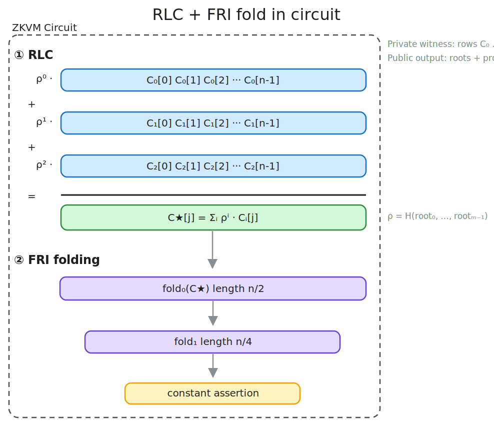
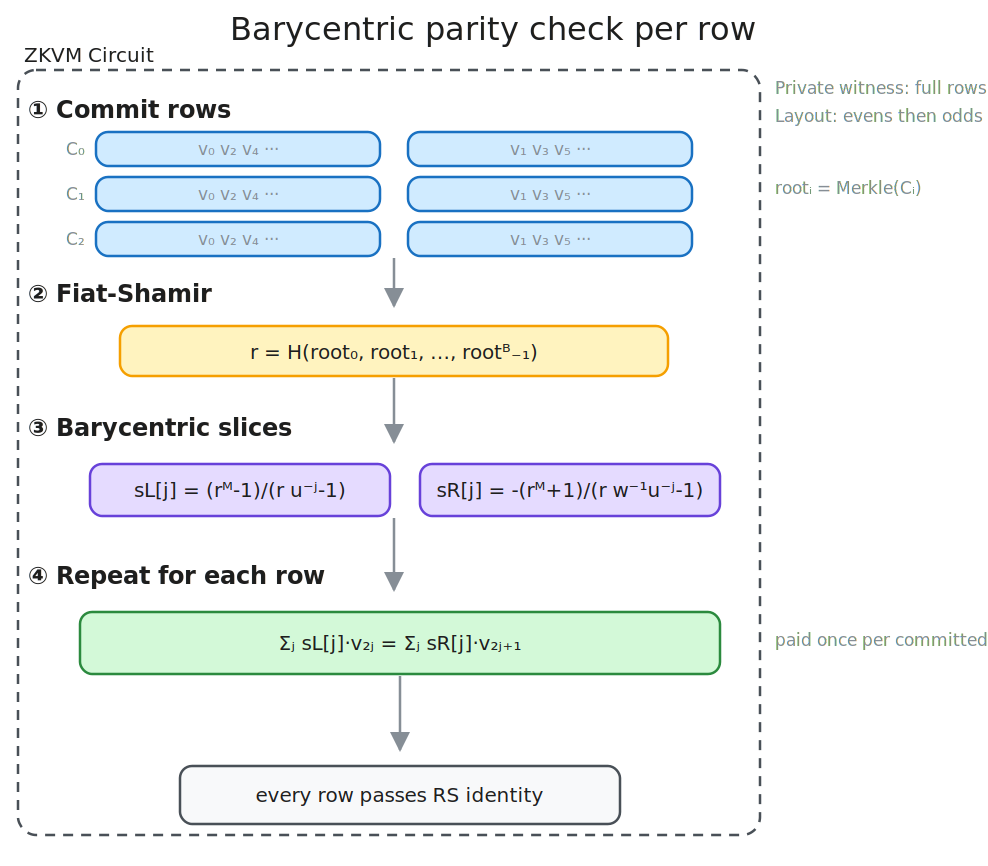

<!-- _class: lead -->

# leanDA

## Post Quantum Proofs of RS codes with leanVM

**Francesco Risitano**

---

<!-- _class: construction -->

## Construction 1 — RLC + FRI Fold In Circuit

**1. Commit rows and sample the RLC challenge.** The transcript binds every row root before sampling $\rho$.

$$
D = H(\operatorname{root}(C_0),\ldots,\operatorname{root}(C_{m-1})),
\qquad
\rho = H(D)
$$

**2. Build one extension-field aggregate codeword.** Every column is combined with powers of $\rho$.

$$
C^\star[j] = \sum_{i=0}^{m-1}\rho^i C_i[j]
$$

**3. Fold the aggregate in the leanVM trace.** Each round halves the domain.

$$
C^{(t+1)}[j] =
\frac{C^{(t)}[2j] + C^{(t)}[2j+1]}{2}
+ \beta_t
\frac{C^{(t)}[2j] - C^{(t)}[2j+1]}{2x_j}
$$

**4. Assert exact RS membership.** The final folded vector must be constant.

$$
C^{(\log n)}[0]=C^{(\log n)}[1]=\cdots
$$

| benchmark | parameters | prove | message throughput | proof |
|---|---:|---:|---:|---:|
| leanDAS headline | $m=240,\ n=4096$, half-rate | 5.28 s | 364 KB/s | 356 KiB |

Implementation: <a href="https://github.com/frisitano/leanDAS/blob/main/rust/crates/das-prover/circuit.py">circuit.py</a> 
Run: <code>cargo run --release --bin leandas -- -m 240 -n 4096 --zkvm</code>

---

<!-- _class: construction -->

## Construction 2 — Barycentric Check Per Row

**1. Commit rows and sample the barycentric point.** The same challenge is used for all row checks.

$$
D = H(\operatorname{root}(C_0),\ldots,\operatorname{root}(C_{B-1})),
\qquad r = \operatorname{Decode}_{\mathbb{E}}(D)
$$

**2. Build the evens/odds barycentric slices.** For row domain roots $u=w^2$:

$$
s_L[j]=\frac{r^M-1}{r u^{-j}-1},
\qquad
s_R[j]=-\frac{r^M+1}{r w^{-1}u^{-j}-1}
$$

**3. Check every row independently.** For $C_i=(v_0,\ldots,v_{2M-1})$:

$$
\sum_{j=0}^{M-1} s_L[j]\,v_{2j}
=
\sum_{j=0}^{M-1} s_R[j]\,v_{2j+1}
$$

| blobs | bytecode | cycles | Poseidon16 | ExtOp | proof | throughput |
|---:|---:|---:|---:|---:|---:|---:|
| 8  | 59,560 | 131,254 | 81,920  | 180,236 | 316.09 KiB | 836.91 KiB/s |
| 16 | 59,656 | 213,286 | 163,840 | 311,308 | 334.89 KiB | 930.65 KiB/s |
| 32 | 59,848 | 377,350 | 327,680 | 573,452 | 351.21 KiB | 949.17 KiB/s |

Implementation: <a href="https://github.com/leanEthereum/leanMultisig/blob/26d851afe7d53f1694057d29a0e8e36f51530f40/crates/lean-da/zkdsl_implem/lean_da.py">lean_da.py</a>, <a href="https://github.com/leanEthereum/leanMultisig/blob/26d851afe7d53f1694057d29a0e8e36f51530f40/crates/lean-da/zkdsl_implem/barycentric.py">barycentric.py</a> 
Run: <code>cargo run --release -p lean-da -- --n-blobs 32</code>

---

<!-- _class: construction construction4 -->

## Construction 3 — Systematic Row Digests + Column Merkle Commitments + Row Barycentric Checks + Cell-Level Sampling

**1. Hash each cell.** Split every row into aligned cells of $L$ extension-field elements. Cell $j$ starts at offset $jL$, then its base-field limbs are chunked and chain-hashed into one 8-FE digest.

$$
\mathrm{cell}_{i,j}=C_i[jL\,..\,(j+1)L)\in\mathbb{E}^{L}
$$

$$
q_{i,j}=H_{\mathrm{chain}}(\operatorname{chunks}(\operatorname{limbs}_{\mathbb{F}}(\mathrm{cell}_{i,j})))\in\mathbb{F}^{8}
$$

**2. Chain only systematic row-cell digests into one digest per row.** The row digest ignores parity cells.

$$
\mathrm{row}_i=H_{\mathrm{chain}}(q_{i,0},\ldots,q_{i,N_{\mathrm{sys}}-1})
$$

$$
R_{\mathrm{rows}}=H_{\mathrm{chain}}(\mathrm{row}_0,\ldots,\mathrm{row}_{B-1})
$$

**3. Merkle-commit each column, then bind row and column commitments together.** Non-power-of-two row counts are zero-padded inside each column tree.

$$
\mathrm{col}_j=\operatorname{Merkle}(q_{0,j},q_{1,j},\ldots,q_{B-1,j},0,\ldots,0)
$$

$$
R_{\mathrm{col}}=\operatorname{Merkle}(\mathrm{col}_0,\ldots,\mathrm{col}_{N-1})
$$

$$
D=H(R_{\mathrm{rows}},R_{\mathrm{col}}), \qquad r=D
$$

**4. Run the standard row barycentric LDT.** The same evens/odds identity is checked for every row.

$$
\sum_{j=0}^{M-1}s_L[j]\,C_i[2j]
=
\sum_{j=0}^{M-1}s_R[j]\,C_i[2j+1]
$$

| blobs | bytecode | cycles | Poseidon16 | ExtOp | proof | throughput |
|---:|---:|---:|---:|---:|---:|---:|
| 12 | 228,887 | 261,655 | 133,135 | 245,772 | 319.83 KiB | 770.04 KiB/s |
| 24 | 382,927 | 448,463 | 266,271 | 442,380 | 338.14 KiB | 711.70 KiB/s |
| 44 | 688,871 | 819,943 | 493,631 | 770,060 | 361.56 KiB | 1,102.26 KiB/s |
| 46 | 689,939 | 821,011 | 513,087 | 802,828 | 363.20 KiB | **1,150.06 KiB/s** |

Implementation: <a href="https://github.com/frisitano/leanMultisig/blob/feat/construction-4-column-commitments/crates/lean-da/zkdsl_implem/lean_da_column_commit.py">lean_da_column_commit.py</a> 
Run: <code>cargo run --release -p lean-da -- --construction column-commit --n-blobs 46 --tracing</code>

