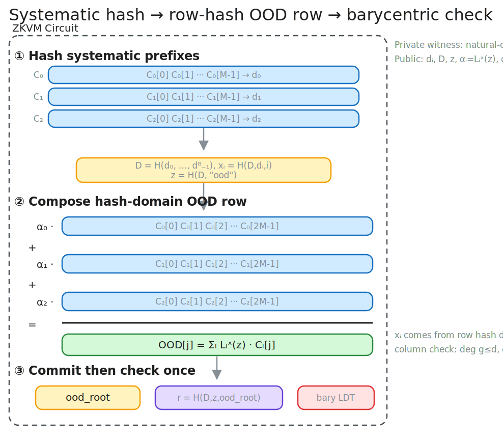

<!-- _class: lead -->

# leanDA

## Post Quantum Proofs of RS codes with leanVM

**Francesco Risitano**

---

<!-- _class: construction -->

## Construction 1 — RLC + FRI Fold In Circuit

**1. Commit rows and sample the RLC challenge.** The transcript binds every row root before sampling $\rho$.

$$
D = H(\operatorname{root}(C_0),\ldots,\operatorname{root}(C_{m-1})),
\qquad
\rho = H(D)
$$

**2. Build one extension-field aggregate codeword.** Every column is combined with powers of $\rho$.

$$
C^\star[j] = \sum_{i=0}^{m-1}\rho^i C_i[j]
$$

**3. Fold the aggregate in the leanVM trace.** Each round halves the domain.

$$
C^{(t+1)}[j] =
\frac{C^{(t)}[2j] + C^{(t)}[2j+1]}{2}
+ \beta_t
\frac{C^{(t)}[2j] - C^{(t)}[2j+1]}{2x_j}
$$

**4. Assert exact RS membership.** The final folded vector must be constant.

$$
C^{(\log n)}[0]=C^{(\log n)}[1]=\cdots
$$

| benchmark | parameters | prove | message throughput | proof |
|---|---:|---:|---:|---:|
| leanDAS headline | $m=240,\ n=4096$, half-rate | 5.28 s | 364 KB/s | 356 KiB |

Implementation: <a href="https://github.com/frisitano/leanDAS/blob/main/rust/crates/das-prover/circuit.py">circuit.py</a> 
Run: <code>cargo run --release --bin leandas -- -m 240 -n 4096 --zkvm</code>

---

<!-- _class: construction -->

## Construction 2 — Barycentric Check Per Row

**1. Commit rows and sample the barycentric point.** The same challenge is used for all row checks.

$$
D = H(\operatorname{root}(C_0),\ldots,\operatorname{root}(C_{B-1})),
\qquad r = \operatorname{Decode}_{\mathbb{E}}(D)
$$

**2. Build the evens/odds barycentric slices.** For row domain roots $u=w^2$:

$$
s_L[j]=\frac{r^M-1}{r u^{-j}-1},
\qquad
s_R[j]=-\frac{r^M+1}{r w^{-1}u^{-j}-1}
$$

**3. Check every row independently.** For $C_i=(v_0,\ldots,v_{2M-1})$:

$$
\sum_{j=0}^{M-1} s_L[j]\,v_{2j}
=
\sum_{j=0}^{M-1} s_R[j]\,v_{2j+1}
$$

| blobs | bytecode | cycles | Poseidon16 | ExtOp | proof | throughput |
|---:|---:|---:|---:|---:|---:|---:|
| 8  | 59,560 | 131,254 | 81,920  | 180,236 | 316.09 KiB | 836.91 KiB/s |
| 16 | 59,656 | 213,286 | 163,840 | 311,308 | 334.89 KiB | 930.65 KiB/s |
| 32 | 59,848 | 377,350 | 327,680 | 573,452 | 351.21 KiB | 949.17 KiB/s |

Implementation: <a href="https://github.com/leanEthereum/leanMultisig/blob/26d851afe7d53f1694057d29a0e8e36f51530f40/crates/lean-da/zkdsl_implem/lean_da.py">lean_da.py</a>, <a href="https://github.com/leanEthereum/leanMultisig/blob/26d851afe7d53f1694057d29a0e8e36f51530f40/crates/lean-da/zkdsl_implem/barycentric.py">barycentric.py</a> 
Run: <code>cargo run --release -p lean-da -- --n-blobs 32</code>

---

<!-- _class: construction -->

## Construction 3 — Systematic Hash + OOD Row + Barycentric Check

**1. Hash systematic prefixes, then bind the row axis.** The row hash fixes both the row commitment and its interpolation coordinate.

$$
d_i = H(C_i[0..M)),\quad D=H(d_0,\ldots,d_{B-1})
$$

$$
x_i=H(D,d_i,i),\qquad z=H(D,\textsf{ood})
$$

**2. Compose the committed OOD aggregate row.** The public $\alpha_i$ are arbitrary-domain Lagrange coefficients over the row-hash points.

$$
\alpha_i=L_i^{\mathbf{x}}(z)
=\prod_{k\ne i}\frac{z-x_k}{x_i-x_k},
\qquad
\operatorname{OOD}[j]=\sum_{i=0}^{B-1}\alpha_i C_i[j]
$$

**3. Open a sampled full column against the OOD row.** The verifier checks the provided column and $\operatorname{OOD}[j]$ lie on one bounded-degree polynomial.

$$
\deg g_j\le d,\qquad g_j(x_i)=c_i,\qquad g_j(z)=\operatorname{OOD}[j]
$$

**4. Commit the OOD row and run one barycentric row check.** The evens/odds identity is paid once on $\operatorname{OOD}$.

$$
r = H(D,z,\operatorname{root}(\operatorname{OOD}))
$$

$$
\sum_{j=0}^{M-1} s_L[j]\,\operatorname{OOD}[2j]
=
\sum_{j=0}^{M-1} s_R[j]\,\operatorname{OOD}[2j+1]
$$

| blobs | bytecode | cycles | Poseidon16 | ExtOp | proof | throughput |
|---:|---:|---:|---:|---:|---:|---:|
| 48 | 287,985 | 1,002,572 | 256,147 | 840,156 | 339.75 KiB | 1,532.29 KiB/s |
| 49 | 290,649 | 1,020,766 | 261,270 | 856,733 | 339.96 KiB | **1,570.01 KiB/s** |
| 50 | 293,367 | 1,039,014 | 266,393 | 873,314 | 364.55 KiB | 1,343.15 KiB/s |
| 51 | 296,139 | 1,057,316 | 271,516 | 889,899 | 336.55 KiB | 792.30 KiB/s |

Trace cliff: 49→50 moves Poseidon to $2^{18}$; 50→51 moves execution to $2^{20}$ and WHIR to 28 vars.

Implementation: <a href="https://github.com/frisitano/leanMultisig/blob/feat/systematic-hash-ood-barycentric/crates/lean-da/zkdsl_implem/lean_da_ood_tiled.py">lean_da_ood_tiled.py</a>, <a href="https://github.com/frisitano/leanMultisig/blob/feat/systematic-hash-ood-barycentric/crates/lean-da/zkdsl_implem/ood_barycentric.py">ood_barycentric.py</a> 
Run: <code>cargo run --release -p lean-da -- --construction ood-row-tiled --n-blobs 49 --tracing</code>

