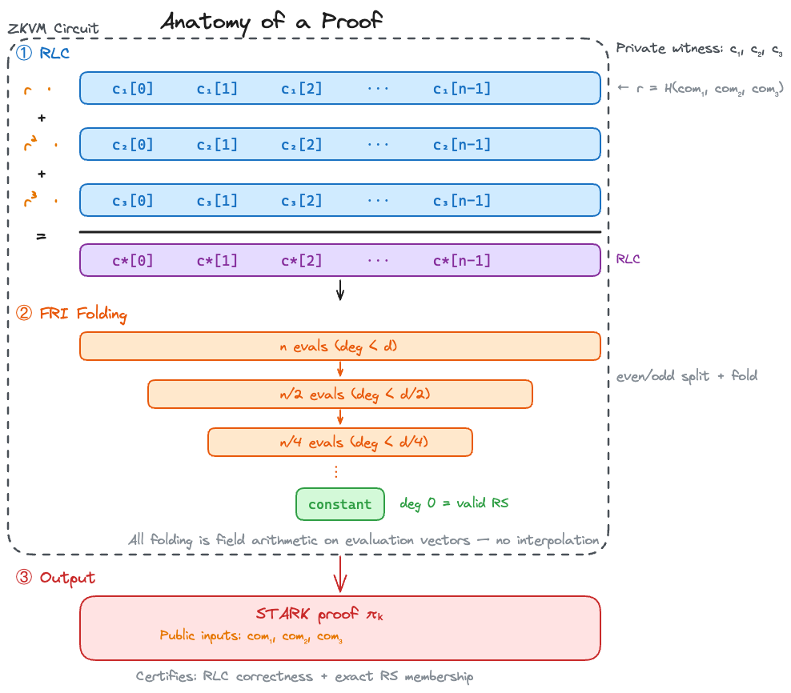

<!-- _class: lead -->

# leanDA

## PQ proofs of RS codes with leanVM

**Francesco Risitano**

---

## The leanDA Construction

**Inputs:** $m$ codewords $c_1, …, c_m \in \mathbb{F}^n$ (one per row of the encoded blob).

**Three steps inside the circuit:**

1. **Commit each row** → Merkle root $\text{com}_i$ via Poseidon2.
2. **Derive RLC challenge** $r \in \mathbb{E}$ from $H(\text{com}_1, …, \text{com}_m)$. Combine row-wise in the **extension field** using powers of $r$:
$$c^*[j] = \sum_{i=1}^{m} r^i \cdot c_i[j] \;\in\; \mathbb{E}$$
3. **Run FRI folding inside the leanVM trace** on $c^*$ — $\log_2(d)$ rounds of degree halving until a constant. The constant assertion is what certifies *exact* RS membership.

---

## Anatomy of a Proof

---

## Benchmarks — Message Throughput (KB/s) — Apple M2 Max

| $m \;\backslash\; n$ | 64 | 256 | 1024 | 4096 |
|---|---|---|---|---|
| **1**   | 1.7 | 4.9 | 8.3 | 11.7 |
| **4**   | 6.7 | 17.7 | 30.9 | 42.8 |
| **16**  | 20.5 | 52.4 | 87.6 | 122.5 |
| **64**  | 49.4 | 101.4 | 167.2 | 187.9 |
| **128** | 59.6 | 117.3 | 192.8 | 164.9 |
| **240** | 72.8 | 210.1 | **309.1** | **293.4** |

**At $m{=}240,\, n{=}4096$:** ~1.92 MB systematic data per proof · **293 KB/s** throughput · 356 KB proof.

---

## Optimisation — Low-Degree-Test Chip

**Idea:** replace inside-the-trace FRI folding with a dedicated **chip enforcing the row-RS annihilating polynomial** as a native AIR constraint.

For each row $v = (v_0, \ldots, v_{2m-1})$, the row-RS code has a parity-check identity with **parity-check coefficients** $c_j(r)$:
$$\sum_{j=0}^{2m-1} c_j(r) \cdot v_j \;=\; 0 \qquad c_j(r) = \sum_{k=m}^{2m-1} r^{k-m} \cdot \omega_h^{-jk}$$
This is the annihilating polynomial of the RS code's dual — degree 1 in $v$, degree $m{-}1$ in $r$.

**One row per RS-validity check**

---

## Links

[github.com/frisitano/leanDAS](https://github.com/frisitano/leanDAS)

