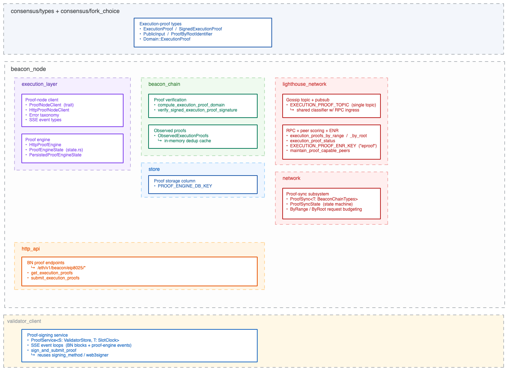

# EIP-8025 Lighthouse Fork — Implementation & Upstreaming Plan

---

## 1. Context

EIP-8025 introduces the full stack of components required to drive the beacon chain using execution proofs as a source of execution-payload validity. The [eth-act/lighthouse](https://github.com/eth-act/lighthouse) `optional-proofs` branch is the reference CL implementation.

**Specs.** The CL-side spec lives in [`consensus-specs/specs/_features/eip8025/`](https://github.com/ethereum/consensus-specs/tree/master/specs/_features/eip8025):

- [`beacon-chain.md`](https://github.com/ethereum/consensus-specs/blob/master/specs/_features/eip8025/beacon-chain.md) — beacon-chain modifications (state fields, block processing).
- [`proof-engine.md`](https://github.com/ethereum/consensus-specs/blob/master/specs/_features/eip8025/proof-engine.md) — proof-engine interface (`verify_execution_proof`, `notify_new_payload`, `notify_forkchoice_updated`, `request_proofs`).
- [`p2p-interface.md`](https://github.com/ethereum/consensus-specs/blob/master/specs/_features/eip8025/p2p-interface.md) — gossip topic, RPC methods, ENR field.
- [`prover.md`](https://github.com/ethereum/consensus-specs/blob/master/specs/_features/eip8025/prover.md) — validator implements a subsystem to generate proofs.

This document describes **what was implemented, how the components compose, and why the key design choices were made.** A short upstreaming-plan section at the end proposes how we'd land this work in sigp/lighthouse.

**Status.** The implementation is feature-complete against the latest consensus-specs draft, with comprehensive unit and integration test coverage in the Rust sources and end-to-end validation on a Kurtosis devnet — including Prysm interop — using the ZKBoost GPU prover as the proof node.

## 2. Top-level architecture



## 3.1 SSZ types & domain constant

EIP-8025 SSZ types and the new `Domain::ExecutionProof` constant (`0x0D`) live in [`consensus/types/src/execution/eip8025.rs`](https://github.com/eth-act/lighthouse/blob/c4215e57f/consensus/types/src/execution/eip8025.rs) and [`consensus/types/src/core/chain_spec.rs`](https://github.com/eth-act/lighthouse/blob/c4215e57f/consensus/types/src/core/chain_spec.rs). They follow the EIP directly.

## 3.2 Validity model

EIP-8025 introduces the **proof engine (PE)** as a second oracle for execution-payload validity, sitting alongside the existing **execution engine (EE)**. The PE derives its verdict from execution proofs instead of re-execution. A node can run with either oracle alone or with both attached; when both verdicts are present and disagree, **the EE's verdict wins** — re-execution remains the canonical source of truth for soundness, and the PE is treated as an optimisation / availability path that can be disabled without compromising correctness. A misbehaving prover or buggy PE cannot fork a node that also has an EE attached.

Whether to allow a node to be operated without the EE is being formalised in two open consensus-specs PRs — LH maintainer input would be welcome:

- [consensus-specs#5161](https://github.com/ethereum/consensus-specs/pull/5161)
- [consensus-specs#5151](https://github.com/ethereum/consensus-specs/pull/5151)

Our fork already supports operation without an EE, but we will not propose that capability for upstream until the open question is firmly decided — making the EE optional in lighthouse touches fork-choice, sync, the engine API surface, and validation paths that today assume an EE is always attached, and the implementation overhead is high enough that we do not want to land it speculatively. Optional-EE follows once the spec is settled.

## 3.3 Proof-node client *(execution_layer)*

**Purpose.** Transport abstraction for the external proof node. The BN talks to a proof node over HTTP + SSZ + SSE; the trait exists primarily so the engine can be exercised in tests against a fully-controllable [`MockProofNodeClient`](https://github.com/eth-act/lighthouse/blob/c4215e57f/beacon_node/execution_layer/src/test_utils/mock_proof_node_client.rs).

The mock is **in-process** rather than a separate mock-prover binary. A standalone HTTP mock would have been a viable alternative, but it forces every test (and every devnet) to orchestrate a second service — extra ports, lifecycles, log streams. Keeping the mock behind the trait means tests run as a single binary and the network simulator (§4.3) can spin up a multi-node topology without external moving parts. To activate the in-process mock at runtime, set `--proof-engine-endpoint=http://mock/{N}/` where `{N}` is a slot index in the mock registry — the BN startup path detects the `http://mock/` prefix and looks up the pre-registered `MockProofNodeClient` for that slot.

**Trait, HTTP impl, mock impl** ([`execution_layer/src/eip8025/proof_node_client.rs`](https://github.com/eth-act/lighthouse/blob/c4215e57f/beacon_node/execution_layer/src/eip8025/proof_node_client.rs), [`execution_layer/src/test_utils/mock_proof_node_client.rs`](https://github.com/eth-act/lighthouse/blob/c4215e57f/beacon_node/execution_layer/src/test_utils/mock_proof_node_client.rs)):

```rust
/// Default timeout for proof node requests (1 second per spec).
pub const PROOF_ENGINE_TIMEOUT: Duration = Duration::from_secs(1);

const PATH_PROOF_REQUESTS: &str     = "/v1/execution_proof_requests";
const PATH_PROOF_VERIFICATIONS: &str = "/v1/execution_proof_verifications";
const PATH_PROOFS: &str             = "/v1/execution_proofs";

#[async_trait::async_trait]
pub trait ProofNodeClient: Send + Sync {
    /// Submit an SSZ-encoded NewPayloadRequest; returns the new_payload_request_root.
    async fn request_proofs(
        &self,
        ssz_body: Vec<u8>,
        proof_attributes: ProofAttributes,
    ) -> Result<Hash256, ProofEngineError>;

    /// Verify a single proof via the proof node.
    async fn verify_proof(
        &self,
        root: Hash256,
        proof_type: u8,
        proof_data: &[u8],
    ) -> Result<ProofStatus, ProofEngineError>;

    /// Download a completed proof by root and proof type.
    async fn get_proof(&self, root: Hash256, proof_type: u8) -> Result<Bytes, ProofEngineError>;

    /// Subscribe to SSE proof events from the proof node.
    fn subscribe_proof_events(
        &self,
        filter_root: Option<Hash256>,
    ) -> Pin<Box<dyn Stream<Item = Result<ProofEvent, ProofEngineError>> + Send + '_>>;
}

pub struct HttpProofNodeClient { /* reqwest-backed impl */ }
```

**Files.**

- [`proof_node_client.rs`](https://github.com/eth-act/lighthouse/blob/c4215e57f/beacon_node/execution_layer/src/eip8025/proof_node_client.rs) — `ProofNodeClient` trait + `HttpProofNodeClient` reqwest impl, SSE stream parsing.
- [`types.rs`](https://github.com/eth-act/lighthouse/blob/c4215e57f/beacon_node/execution_layer/src/eip8025/types.rs) — `ProofType` enum, SSE event types.
- [`errors.rs`](https://github.com/eth-act/lighthouse/blob/c4215e57f/beacon_node/execution_layer/src/eip8025/errors.rs) — `ProofEngineError` and `ProofEngineStateError` taxonomies (numeric error codes).
- [`mock_proof_node_client.rs`](https://github.com/eth-act/lighthouse/blob/c4215e57f/beacon_node/execution_layer/src/test_utils/mock_proof_node_client.rs) — `MockProofNodeClient` + `MockClientEvent` for in-process tests; see §4.1, §4.3.

## 3.4 Proof engine *(execution_layer)*

**Purpose.** In-process owner of proof state. Consumes new payloads and execution proofs, derives a payload-validity verdict from each proof via `ProofNodeClient`, maintains a tree of payloads and their associated proofs, and persists state across restarts. Conceptually the proof engine is an **execution-payload validity oracle** in the same role as the execution engine, with the validity verdict derived from execution proofs instead of re-execution.

**Engine** ([`execution_layer/src/eip8025/proof_engine.rs`](https://github.com/eth-act/lighthouse/blob/c4215e57f/beacon_node/execution_layer/src/eip8025/proof_engine.rs)):

```rust
/// Proof engine with internal proof storage.
///
/// - Stores ALL unfinalized proofs indexed by new_payload_request_root (unbounded)
/// - Delegates transport to a ProofNodeClient implementation
/// - Prunes proofs when finalization events occur
pub struct HttpProofEngine {
    proof_node: Box<dyn ProofNodeClient>,
    /// Internal state: tree-structured proof storage + buffered proofs.
    state: RwLock<State>,
    /// Buffered proofs for request roots not yet seen (arrive-before-request races).
    buffered_proofs: RwLock<HashMap<Hash256, Vec<SignedExecutionProof>>>,
}
```

**Interface.** The four spec-mandated methods (additional methods redacted from this document) from [`specs/_features/eip8025/proof-engine.md`](https://github.com/ethereum/consensus-specs/blob/master/specs/_features/eip8025/proof-engine.md) — invoked by the beacon chain's block-import and fork-choice paths:

```rust
impl HttpProofEngine {
    // (other methods elided)

    pub async fn verify_execution_proof(
        &self,
        proof: &SignedExecutionProof,
    ) -> Result<ProofStatus, ProofEngineError>;

    pub async fn new_payload<E: EthSpec>(
        &self,
        request: &NewPayloadRequest<'_, E>,
    ) -> Result<PayloadStatusV1, ProofEngineError>;

    pub fn forkchoice_updated(
        &self,
        forkchoice_state: ForkchoiceState,
    ) -> Result<ForkchoiceUpdatedResponse, ProofEngineError>;

    pub async fn request_proofs<E: EthSpec>(
        &self,
        new_payload_request: NewPayloadRequest<'_, E>,
        proof_attributes: ProofAttributes,
    ) -> Result<Hash256, ProofEngineError>;
}
```

**State machine** ([`state.rs`](https://github.com/eth-act/lighthouse/blob/c4215e57f/beacon_node/execution_layer/src/eip8025/state.rs), 1,754 LOC):

```rust
pub struct State {
    /// Latest fork-choice state received that has not yet been marked valid.
    pub latest_fcs: Option<ForkchoiceState>,
    /// The last fork-choice state that was marked valid (drives pruning).
    pub last_valid_fcs: ForkchoiceState,
    /// Tree of execution proofs over parent/children block lineage —
    /// keyed by execution block hash, with a request-root → block-hash index
    /// and a block-number → block-hashes secondary index.
    pub tree: TreeState,
    /// Buffer of unassociated proofs / requests; entries promote into `tree`
    /// once a request and ≥ `min_required_proofs` matching proofs have arrived.
    pub buffer: RequestBuffer,
    /// Minimum proofs needed to promote a request from `buffer` to `tree`.
    pub min_required_proofs: usize,
}
```

Payloads and proofs land in the buffer first; once a payload has accumulated enough matching proofs to be considered valid, it is promoted into the tree along with those proofs. The BN's existing fork-choice store could possibly back part of this more efficiently, but we kept it as an isolated tree to avoid perturbing the standard EL flow.

**Persisted form** ([`persisted_state.rs`](https://github.com/eth-act/lighthouse/blob/c4215e57f/beacon_node/execution_layer/src/eip8025/persisted_state.rs), 493 LOC):

```rust
pub const PROOF_ENGINE_STATE_VERSION: u64 = 1;
pub const PROOF_ENGINE_DB_KEY: Hash256 = Hash256::ZERO;

#[derive(Clone, Debug, PartialEq, Encode, Decode)]
pub struct PersistedProofEngineState {
    pub version: u64,
    pub tree:            PersistedTreeState,
    pub block_proofs:    PersistedBlockProofs,
    pub request_root_mapping:   RequestRootMapping,
    pub parent_children:        PersistedParentChildren,
    pub block_number_mapping:   PersistedBlockNumberMapping,
    pub request_buffer:         PersistedRequestBuffer,
}
impl StoreItem for PersistedProofEngineState { /* single SSZ blob under PROOF_ENGINE_DB_KEY */ }
```
## 3.5 Observed-proofs cache *(beacon_chain)*

**Purpose.** In-memory dedup cache that implements the `IGNORE-2` / `IGNORE-3` rules from the EIP-8025 p2p-interface spec. Checked *before* BLS / proof-node verification to avoid redundant work.

**API** ([`beacon_chain/src/observed_execution_proofs.rs`](https://github.com/eth-act/lighthouse/blob/c4215e57f/beacon_node/beacon_chain/src/observed_execution_proofs.rs)):

```rust
#[derive(Debug, Default)]
pub struct ObservedExecutionProofs {
    /// IGNORE-2: we already have a valid proof for (request_root, proof_type).
    valid_proofs: HashMap<(Hash256, ProofType), ()>,
    /// IGNORE-3: we have already attempted verification for (root, type, pubkey).
    seen_from_validator: HashSet<(Hash256, ProofType, PublicKeyBytes)>,
    /// Slot → request-roots observed, for eviction at finalization.
    slot_to_request_roots: HashMap<Slot, HashSet<Hash256>>,
}

pub enum ProofObservation {
    /// We already have a valid proof for this (request_root, proof_type) — IGNORE-2.
    AlreadyHaveValidProof,
    /// We already saw a proof from this validator for this (request_root, proof_type) — IGNORE-3.
    DuplicateFromValidator,
    /// First time seeing this proof — proceed with verification.
    New,
}

impl ObservedExecutionProofs {
    pub fn check(
        &self,
        request_root: Hash256,
        proof_type: ProofType,
        validator_pubkey: &PublicKeyBytes,
    ) -> ProofObservation { /* ... */ }
}
```

**Design decisions.**

- **Slot-indexed eviction** keeps the cache bounded: proofs for finalized blocks are dropped whole-slot at a time, matching existing observation-cache patterns (`observed_proposers`, `observed_attestations`).
- **Check is pure** — call sites `observe_verification_attempt` / `observe_valid_proof` after verification completes. Avoids lock-holding during BLS work.
- **In-memory only** — no persistence; finalization eviction means a restart costs at most one finality cycle of warm-up before the cache is repopulated by gossip.

## 3.6 Proof storage *(beacon_node/store)*

**Purpose.** Give the proof engine a place to checkpoint its state across restarts. A new hot/cold column, a single well-known key (`Hash256::ZERO`), and a schema bump.

**Changes.** New column added to [`beacon_node/store/src/hot_cold_store.rs`](https://github.com/eth-act/lighthouse/blob/c4215e57f/beacon_node/store/src/hot_cold_store.rs); schema version bumped to v29. The migration ([`migration_schema_v29.rs`](https://github.com/eth-act/lighthouse/blob/c4215e57f/beacon_node/beacon_chain/src/schema_change/migration_schema_v29.rs)) is a no-op — it just reserves the column slot. Downgrade discards the column.

**Retention.** Proofs older than the finalized head are not retained. The finalized head serves as the proof engine's trust anchor — anything below it is assumed valid by virtue of finality, matching the EL's finality assumption. This keeps the column bounded, the persisted state small, and the data model simple.

## 3.7 Gossip topic + pubsub *(lighthouse_network + network)*

**Purpose.** Single global gossip topic for execution proofs. Incoming proof messages go through the same classification path whether they arrive via pubsub or RPC.

**Topic constant** ([`lighthouse_network/src/types/topics.rs`](https://github.com/eth-act/lighthouse/blob/c4215e57f/beacon_node/lighthouse_network/src/types/topics.rs)):

```rust
pub const EXECUTION_PROOF_TOPIC: &str = "execution_proof";
```

**Handlers** ([`network/src/network_beacon_processor/gossip_methods.rs`](https://github.com/eth-act/lighthouse/blob/c4215e57f/beacon_node/network/src/network_beacon_processor/gossip_methods.rs)):

- [`pub async fn process_gossip_execution_proof(...)`](https://github.com/eth-act/lighthouse/blob/c4215e57f/beacon_node/network/src/network_beacon_processor/gossip_methods.rs#L1882) — the pubsub entry point
- [`pub async fn process_rpc_execution_proof(...)`](https://github.com/eth-act/lighthouse/blob/c4215e57f/beacon_node/network/src/network_beacon_processor/gossip_methods.rs#L2092) — RPC entry point; routes through the same classification as the gossip path
- [`fn classify_execution_proof_error(...)`](https://github.com/eth-act/lighthouse/blob/c4215e57f/beacon_node/network/src/network_beacon_processor/gossip_methods.rs#L2203) — maps verifier errors to gossipsub score actions
- [`fn should_process_execution_proof(...)`](https://github.com/eth-act/lighthouse/blob/c4215e57f/beacon_node/network/src/network_beacon_processor/gossip_methods.rs#L2284) — the shared classification used by both ingress paths

**Design**

- **Single global topic**, not sharded based on proof type.
- **Shared classifier between gossip and RPC ingress** avoids validation drift.

## 3.8 RPC protocols *(lighthouse_network)*

**Purpose.** Three new libp2p RPC protocols for execution-proof request/response, decomposed on the same pattern as `blocks_by_range` / `blocks_by_root` / `status`.

**Protocols** ([`lighthouse_network/src/rpc/protocol.rs`](https://github.com/eth-act/lighthouse/blob/c4215e57f/beacon_node/lighthouse_network/src/rpc/protocol.rs)):

```rust
#[strum(serialize = "execution_proofs_by_range")] ExecutionProofsByRange,
#[strum(serialize = "execution_proofs_by_root")]  ExecutionProofsByRoot,
#[strum(serialize = "execution_proof_status")]    ExecutionProofStatus,

// All V1:
SupportedProtocol::ExecutionProofsByRangeV1,
SupportedProtocol::ExecutionProofsByRootV1,
SupportedProtocol::ExecutionProofStatusV1,

/// Minimum SSZ size of a SignedExecutionProof (empty proof_data):
pub const SIGNED_EXECUTION_PROOF_MIN_SIZE: usize = 4 + 8 + 96 + 37;
/// Maximum SSZ size: fixed header + MaxProofSize (409600 bytes).
pub const SIGNED_EXECUTION_PROOF_MAX_SIZE: usize = 4 + 8 + 96 + 37 + 409600;
```

**Request types** ([`lighthouse_network/src/rpc/methods.rs`](https://github.com/eth-act/lighthouse/blob/c4215e57f/beacon_node/lighthouse_network/src/rpc/methods.rs)):

```rust
pub struct ExecutionProofsByRangeRequest {
    pub start_slot: u64,
    pub count: u64,
    /// Per-block proof-type filters. Empty means "return all proof types for every block."
    /// Blocks listed with specific types get only those types — lets the server skip proofs
    /// the requester already has.
    pub proof_filters: RuntimeVariableList<ProofByRootIdentifier>,
}

pub struct ExecutionProofsByRootRequest {
    /// Each entry identifies a block root and the proof types the requester currently
    /// has for it; the server returns only the missing types.
    pub identifiers: RuntimeVariableList<ProofByRootIdentifier>,
}

pub struct ExecutionProofStatus {
    /// Block root of the latest block verified by this peer.
    pub block_root: Hash256,
    /// Slot of the latest block verified by this peer.
    pub slot: u64,
}
```

**Design decisions.**

- **Three protocols, not one.** Mirrors the existing blocks-family decomposition; each protocol has its own rate limiter and response-termination semantics.
- **`proof_filters` on ByRange** lets the server skip proof types the requester already holds — critical because each proof can be up to 400 KiB. Without per-block filtering, a requester with 3 of 4 proof types would re-download the 3 they already have.
- **`ExecutionProofStatus` is a separate handshake from the existing `Status` RPC.** Upstream `Status` advertises the peer's latest head as determined by **re-execution** — its view of the canonical chain. `ExecutionProofStatus` advertises the peer's view as determined by **execution-proof verification**, which proof sync uses to pick peers to fetch proofs from. Keeping the two as distinct protocols avoids any conflict with peers that don't speak the optional-proofs feature: such peers continue to participate in regular `Status` exchanges unchanged, and only proof-capable peers exchange `ExecutionProofStatus`.

## 3.9 Peer scoring + ENR *(lighthouse_network)*

**Purpose.** Advertise proof-node capability via an ENR field; apply appropriate score penalties for proof-protocol abuse; maintain a minimum number of connected proof-capable peers via discovery pressure.

**ENR advertisement** ([`lighthouse_network/src/discovery/enr.rs`](https://github.com/eth-act/lighthouse/blob/c4215e57f/beacon_node/lighthouse_network/src/discovery/enr.rs)):

```rust
/// ENR field indicating execution proof node support.
pub const EXECUTION_PROOF_ENR_KEY: &str = "eproof";

pub trait Eth2Enr {
    // ... existing methods ...
    /// Whether this node has an execution proof node configured.
    fn execution_proof_enabled(&self) -> bool;
}
```

**Peer manager** ([`lighthouse_network/src/peer_manager/mod.rs`](https://github.com/eth-act/lighthouse/blob/c4215e57f/beacon_node/lighthouse_network/src/peer_manager/mod.rs)):

```rust
pub const MIN_EXECUTION_PROOF_PEERS: u64 = 1;

// In the protocol-violation dispatcher:
Protocol::ExecutionProofsByRange  => PeerAction::MidToleranceError,
Protocol::ExecutionProofsByRoot   => PeerAction::MidToleranceError,
// ExecutionProofStatus is a soft informational request; rate-limiting is fine.
Protocol::ExecutionProofStatus    => return,

fn maintain_proof_capable_peers(&mut self) {
    // If we have < MIN_EXECUTION_PROOF_PEERS proof-capable peers connected,
    // trigger discovery with Subnet::ExecutionProof as the target.
}
```

**Design decisions.**

- **ENR is a single capability bool.** Keeps the ENR small; proof-type negotiation happens at RPC time, not discovery.
- **`MidToleranceError` for ByRange/ByRoot abuse** borrows the severity tier from blocks-by-range.
- **`ExecutionProofStatus` violations do not affect score.** It's an informational exchange; abusers are rate-limited, not penalized.
- **`Subnet::ExecutionProof` is a capability flag, not a real gossip subnet.** Type-system cleanliness argument: a `Capability` enum would be clearer, but reusing `Subnet` keeps peer bookkeeping uniform with attestation/sync-committee tracking.

## 3.10 Proof-sync subsystem *(network)*

**Purpose.** Dedicated catch-up mechanism for execution proofs missing from the local proof engine after block range-sync completes. Runs parallel to historical blob sync.

**How "missing" is determined.** The proof engine is the source of truth: each poll, the sync loop calls [`ProofEngine::missing_proofs()`](https://github.com/eth-act/lighthouse/blob/c4215e57f/beacon_node/execution_layer/src/eip8025/proof_engine.rs#L105), which returns the buffer entries that don't yet have enough validated proofs to promote into the tree (i.e. fewer than `min_required_proofs`). The sync subsystem then chooses range vs. by-root requests over the resulting set; once promoted entries fall out of `missing_proofs()`, the loop drains naturally.

**Core types** ([`network/src/sync/proof_sync.rs`](https://github.com/eth-act/lighthouse/blob/c4215e57f/beacon_node/network/src/sync/proof_sync.rs)):

```rust
/// Tracks the single in-flight ExecutionProofsByRange request.
pub(crate) struct ByRangeRequest {
    pub(crate) id: ExecutionProofsByRangeRequestId,
    pub(crate) peer_id: PeerId,
}

/// Tracks the single in-flight ExecutionProofsByRoot batch request.
pub(crate) struct ByRootRequest {
    pub(crate) id: ExecutionProofsByRootRequestId,
    pub(crate) peer_id: PeerId,
}

/// Operating mode for the proof sync subsystem.
pub enum ProofSyncState {
    /// Range sync is active; proof sync is paused.
    Idle,
    /// Proof sync is active. Each poll queries the proof engine for missing proofs
    /// and chooses between range or by-root requests based on byte-efficiency.
    Syncing,
}

/// Number of slot ticks to skip after a response stream completes before issuing
/// the next request. Lets the beacon processor import received proofs first.
const POST_REQUEST_COOLDOWN_SLOTS: u64 = 1;

pub struct ProofSync<T: BeaconChainTypes> {
    chain: Arc<BeaconChain<T>>,
    state: ProofSyncState,
    range_request: Option<ByRangeRequest>,
    root_request:  Option<ByRootRequest>,
    post_request_cooldown: u64,
    peer_statuses: HashMap<PeerId, CachedExecutionProofStatus>,
    status_in_flight: HashMap<PeerId, ExecutionProofStatusRequestId>,
    // ...
}
```

**Design decisions.**

- **Dedicated subsystem.** Block sync is latency-critical and on the fork-choice path; stapling proof requests into its I/O budget would couple two unrelated failure modes.
- **Byte-efficiency-driven strategy.** Each poll compares the SSZ size of an `ExecutionProofsByRange` request (20-byte fixed header + `proof_filters` for partially-held blocks) against an `ExecutionProofsByRoot` request (one identifier per missing block). Whichever encodes smaller wins. This leans on `proof_filters` for partial-coverage cases.
- **Post-request cooldown** (`POST_REQUEST_COOLDOWN_SLOTS = 1`) prevents immediate re-requesting after a response stream completes — gives the beacon processor a slot to import proofs so they stop appearing in `missing_proofs()`.
- **Two-state FSM.** `Idle` while block range sync is active; `Syncing` once block range sync is complete. In-flight responses are always processed regardless of state.

## 3.11 HTTP API *(beacon_node/http_api)*

**Purpose.** BN endpoints for reading proof state and accepting validator-signed proofs for re-broadcast.

**Handlers** ([`beacon_node/http_api/src/eip8025.rs`](https://github.com/eth-act/lighthouse/blob/c4215e57f/beacon_node/http_api/src/eip8025.rs)):

- `GET /eth/v1/beacon/proofs/execution_proofs/{block_id}` → `get_execution_proofs` — returns `ExecutionProofsResponse { execution_optimistic, finalized, data: Vec<SignedExecutionProof> }`.
- `POST /eth/v1/beacon/execution_proofs` → `submit_execution_proofs` — accepts `SubmitExecutionProofsRequest { proofs }` and re-gossips after validation.

**Design decisions.**

- **Presence of a proof-node endpoint is the only gate.** Both endpoints require `--proof-engine-endpoint` to be set — if absent, they return a clear error rather than silently succeeding with empty results.
- **Submit endpoint re-gossips after validation.** Accepting a proof via HTTP semantically equals receiving it over gossip; the BN propagates it so the local validator's signature reaches the rest of the network.

## 3.12 Proof-signing service *(validator_client)*

**Purpose.** Watches beacon-node events and proof-node events over SSE; when a signing opportunity arrives, signs the proof with the validator's key and submits back to the BN for gossip.

**API and tasks** ([`validator_client/validator_services/src/proof_service.rs`](https://github.com/eth-act/lighthouse/blob/c4215e57f/validator_client/validator_services/src/proof_service.rs)):

```rust
const PROOF_REQUEST_STALE_TIMEOUT: Duration = Duration::from_secs(300);

struct OutstandingProofRequest {
    pending_proof_types: HashSet<u8>,
    slot: Slot,
    requested_at: Instant,
}

pub struct ProofService<S: ValidatorStore, T: SlotClock> {
    inner: Arc<Inner<S, T>>,
}

struct Inner<S: ValidatorStore, T: SlotClock> {
    validator_store: Arc<S>,
    beacon_nodes: Arc<BeaconNodeFallback<T>>,
    proof_engine: Arc<HttpProofEngine>,
    slot_clock: T,
    executor: TaskExecutor,
    proof_types: Vec<u8>,
    /// Outstanding proof requests keyed by new_payload_request_root.
    outstanding_requests: RwLock<HashMap<Hash256, OutstandingProofRequest>>,
}

impl<S: ValidatorStore + 'static, T: 'static + SlotClock + Clone> ProofService<S, T> {
    pub fn start_service(self: Arc<Self>) -> Result<(), String> {
        // Spawn two SSE consumers:
        //   monitor_events_task              — BN block events
        //   monitor_proof_engine_events_task — proof-node completion events
        // ...
    }
}
```

Two concurrent tasks:

1. **Beacon event monitor** subscribes to BN SSE for new blocks. On each new block: request proofs from the proof engine.
2. **Proof node event monitor** subscribes to the proof node's SSE stream. On `ProofComplete`: fetch the completed proof, sign it, and submit to the BN. On `ProofFailure`: log + metric.
## 4. Testing & devnet evidence

### 4.1 Unit coverage

SSZ round-trips for every new type in `consensus/types/src/execution/eip8025.rs`; proof-engine behaviour against `MockProofNodeClient` ([`tests.rs`](https://github.com/eth-act/lighthouse/blob/c4215e57f/beacon_node/execution_layer/src/eip8025/tests.rs), 287 LOC); verification/domain tests in [`proof_verification.rs`](https://github.com/eth-act/lighthouse/blob/c4215e57f/beacon_node/beacon_chain/src/eip8025/proof_verification.rs); cache round-trips in [`observed_execution_proofs.rs`](https://github.com/eth-act/lighthouse/blob/c4215e57f/beacon_node/beacon_chain/src/observed_execution_proofs.rs); `PersistedProofEngineState` SSZ round-trips in [`persisted_state.rs`](https://github.com/eth-act/lighthouse/blob/c4215e57f/beacon_node/execution_layer/src/eip8025/persisted_state.rs).

### 4.2 RPC + sync integration tests

[`rpc_tests.rs`](https://github.com/eth-act/lighthouse/blob/c4215e57f/beacon_node/lighthouse_network/tests/rpc_tests.rs) (+208 LOC on the new protocols — size bounds, malformed input, termination semantics); [`range.rs`](https://github.com/eth-act/lighthouse/blob/c4215e57f/beacon_node/network/src/sync/tests/range.rs) sync tests (+1,001 LOC covering range + proof-sync concurrency with partial-coverage filters).

### 4.3 In-process integration test rig

The headline test surface is **`ProofEngineTestRig`** ([`testing/proof_engine/src/rig.rs`](https://github.com/eth-act/lighthouse/blob/c4215e57f/testing/proof_engine/src/rig.rs)), a thin wrapper over `TestNetworkFixture` ([`testing/simulator/src/test_utils/`](https://github.com/eth-act/lighthouse/blob/c4215e57f/testing/simulator/src/test_utils/mod.rs)) that spins up a multi-node beacon network — proof generators, verifiers, vanilla nodes — entirely in-process, with mock execution layers and a `MockProofNodeClient` per node.

```rust
pub type E = MinimalEthSpec;

/// Test harness for EIP-8025 proof engine integration tests.
pub struct ProofEngineTestRig {
    pub fixture: TestNetworkFixture<E>,
}
```

`TestNetworkFixture` is the **same machinery as the existing simulator binary**, restructured so the network can be brought up *inside* a Rust test instead of as a separate process. Maintainers currently relying on the simulator can treat this as a drop-in replacement: same node types, same execution mock — but driven from `#[tokio::test]` with full `async`/await access. `ProofEngineTestRig` constructors just preset `LocalNetworkParams` topology fields and call `.build()`.

```rust
pub struct TestNetworkFixture<E: EthSpec = MinimalEthSpec> {
    pub env:     TestEnvironment<E>,
    pub network: LocalNetwork<E>,
    pub config:  TestConfig,
}
```

**Two parallel event streams** are exposed for assertions, designed to be joined with `try_join!` to prove concurrent behaviour across the mock and chain sides.

**1. Mock proof-node events** — emitted by `MockProofNodeClient` per method invocation; subscribe via `subscribe_client_events()` ([`mock_proof_node_client.rs`](https://github.com/eth-act/lighthouse/blob/c4215e57f/beacon_node/execution_layer/src/test_utils/mock_proof_node_client.rs)). Wrapped by [`MockEventStream`](https://github.com/eth-act/lighthouse/blob/c4215e57f/beacon_node/execution_layer/src/test_utils/mock_event_stream.rs) with `expect_proof_requests / _verified / _fetched` helpers.

```rust
#[derive(Debug, Clone)]
pub enum MockClientEvent {
    ProofRequested { ssz_body: Vec<u8>, proof_attributes: ProofAttributes, root: Hash256 },
    ProofVerified  { root: Hash256, proof_type: u8 },
    ProofFetched   { root: Hash256, proof_type: u8 },
}
```

**2. Internal beacon-chain events** — emitted from `BeaconChain` ingress / sync / verification sites; subscribe via `BeaconChain::subscribe_internal_events()` ([`internal_events.rs`](https://github.com/eth-act/lighthouse/blob/c4215e57f/beacon_node/beacon_chain/src/internal_events.rs)). Wrapped by `EventStream::collect_n(n, predicate, timeout)`.

```rust
#[derive(Debug, Clone)]
pub enum InternalBeaconNodeEvent {
    /// Arrived via gossip, before dedup/verification.
    GossipExecutionProof(Arc<SignedExecutionProof>),
    /// Arrived via RPC sync, before dedup/verification.
    RpcExecutionProof(Arc<SignedExecutionProof>),
    /// Outbound `ExecutionProofsByRange` request sent to a peer.
    OutboundExecutionProofsByRange { start_slot: Slot, count: u64 },
    /// Outbound `ExecutionProofsByRoot` request sent to a peer.
    OutboundExecutionProofsByRoot { identifiers: Vec<ProofByRootIdentifier> },
    /// `verify_execution_proof` completed; carries status and (when known) block root + slot.
    ExecutionProofVerified {
        request_root: Hash256,
        status: ProofStatus,
        block: Option<(Hash256, Slot)>,
    },
    /// `verify_execution_proof` returned an error.
    ExecutionProofVerificationFailed { request_root: Hash256, error: String },
}
```

**Built-in topologies** (`base_builder()` defaults: 4 validators, 1-second slots, fulu at genesis):

| Constructor | Composition |
|---|---|
| [`standard()`](https://github.com/eth-act/lighthouse/blob/c4215e57f/testing/proof_engine/src/rig.rs#L30) | 1 vanilla + 1 generator + 1 verifier |
| [`sync_topology()`](https://github.com/eth-act/lighthouse/blob/c4215e57f/testing/proof_engine/src/rig.rs#L36) | 1 vanilla + 1 generator + 1 delayed node (verifier added mid-test) |
| [`multi_generator()`](https://github.com/eth-act/lighthouse/blob/c4215e57f/testing/proof_engine/src/rig.rs#L55) | 1 vanilla + 2 generators + 1 verifier |
| [`builder()`](https://github.com/eth-act/lighthouse/blob/c4215e57f/testing/proof_engine/src/rig.rs#L202) | escape hatch — full `TestNetworkFixtureBuilder` access |

Mid-test additions via [`rig.add_proof_verifier_and_subscribe()`](https://github.com/eth-act/lighthouse/blob/c4215e57f/testing/proof_engine/src/rig.rs#L163) — used for late-joiner sync recovery tests.

**Idiomatic test shape:**

```rust
let mut rig = ProofEngineTestRig::standard().await?;
rig.fixture.payloads_valid();
rig.fixture.wait_for_genesis().await?;

let mut gen_mock = rig.proof_generator_events(0)?;       // MockClientEvent stream
let mut verifier = rig.proof_verifier_chain_events(0)?;  // InternalBeaconNodeEvent stream

gen_mock.expect_proof_requests(1, Duration::from_secs(30)).await?;
verifier.collect_n(
    1,
    |e| matches!(e, InternalBeaconNodeEvent::ExecutionProofVerified { .. }),
    Duration::from_secs(60),
).await?;
```

Full coverage in [`testing/proof_engine/src/lib.rs`](https://github.com/eth-act/lighthouse/blob/c4215e57f/testing/proof_engine/src/lib.rs): basic gossip → verify path, mid-test verifier joins (proof sync via RPC), multi-generator request fan-out, and full-network finalization with the proof pipeline running.

### 4.4 Devnet (Kurtosis)

Overlay config via [ethpandaops/ethereum-package](https://github.com/ethpandaops/ethereum-package); full validator-signed → gossip → chain-finalized flow demonstrated with [ZKBoost](https://github.com/eth-act/zkboost) as the proof node.

| File | Role |
|---|---|
| [`scripts/local_testnet/network_params_eip8025.yaml`](https://github.com/eth-act/lighthouse/blob/c4215e57f/scripts/local_testnet/network_params_eip8025.yaml) | Topology fixture — baseline EIP-8025 network params |
| [`scripts/local_testnet/network_params_eip8025_zkboost.yaml`](https://github.com/eth-act/lighthouse/blob/c4215e57f/scripts/local_testnet/network_params_eip8025_zkboost.yaml) | Topology fixture — ZKBoost proof node (CPU) |
| [`scripts/local_testnet/network_params_eip8025_zkboost_gpu.yaml`](https://github.com/eth-act/lighthouse/blob/c4215e57f/scripts/local_testnet/network_params_eip8025_zkboost_gpu.yaml) | Topology fixture — ZKBoost proof node (GPU) |
| [`scripts/local_testnet/start_eip8025_testnet.sh`](https://github.com/eth-act/lighthouse/blob/c4215e57f/scripts/local_testnet/start_eip8025_testnet.sh) | Launcher — spins up the Kurtosis devnet |

## 5. Upstreaming plan

**Fork point & drift.** Merge base with `upstream/unstable` is `58b153cac` (2026-01-16, 3 months old). Our delta is 194 files / +26,560 / −2,052 LOC across 109 commits. Upstream has advanced 466 files / +36,773 / −15,959 LOC across 180 commits, 120 of which overlap with our changes. Hottest zones by overlap: `beacon_chain` (21 files, 81%), `network` (16, 89%), `lighthouse_network` (16, 73%), `http_api` (8, 73%).

**Proposed PR sequence** — a rebase onto current upstream first (PR 0), then component-scoped PRs in dependency order:

| #   | Title                           | Scope                                                                                                                                            |
| --- | ------------------------------- | ------------------------------------------------------------------------------------------------------------------------------------------------ |
| 0   | Rebase                          | Rebase `optional-proofs` onto `upstream/unstable`; verify with full test suite + Kurtosis devnet before opening any follow-up PR.                |
| 1   | Types foundation                | `consensus/types::execution::eip8025` SSZ types and `Domain::ExecutionProof`.                                                                    |
| 2   | Proof-node client               | `ProofNodeClient` trait, `HttpProofNodeClient`, transport types, error taxonomy, `MockProofNodeClient`.                                          |
| 3   | Proof engine + storage          | `HttpProofEngine`, tree-structured state machine, `store` column + schema v29 (migration co-located with its first writer).                      |
| 4   | HTTP API                        | BN execution-proof read/submit endpoints.                                                                                                        |
| 5   | Gossip + verification           | Pubsub topic + routing, shared classifier, BLS verification, observed-proofs cache, beacon_chain block-import hooks — receive-side ingress wired end-to-end. |
| 6   | Validator proof-signing service | `ProofService`, SSE event loop, signing-method extension.                                                                                        |
| 7   | In-process integration test rig | `ProofEngineTestRig`, `TestNetworkFixture`, `InternalBeaconNodeEvent` broadcast channel, `EventStream` helpers, built-in multi-node topologies.  |
| 8   | RPC + peer scoring + ENR        | Three new req/resp protocols, ENR capability bit, peer scoring, discovery pressure.                                                              |
| 9   | Proof-sync subsystem            | `ProofSync` poller, sync-manager integration, network-context plumbing.                                                                          |

## 6. References

Concrete code surface for maintainers. All paths are at `eth-act/lighthouse @ c4215e57f`; the § column points back to where each file is discussed in this document.

| Crate | File | Description | § |
|---|---|---|---|
| `consensus/types` | [`src/execution/eip8025.rs`](https://github.com/eth-act/lighthouse/blob/c4215e57f/consensus/types/src/execution/eip8025.rs) | `ExecutionProof`, `SignedExecutionProof`, `PublicInput`, `ProofByRootIdentifier`, `MIN_REQUIRED_EXECUTION_PROOFS` | §3.1 |
| `consensus/types` | [`src/core/chain_spec.rs`](https://github.com/eth-act/lighthouse/blob/c4215e57f/consensus/types/src/core/chain_spec.rs) | `Domain::ExecutionProof` (`0x0D`) constant | §3.1 |
| `execution_layer` | [`src/eip8025/proof_node_client.rs`](https://github.com/eth-act/lighthouse/blob/c4215e57f/beacon_node/execution_layer/src/eip8025/proof_node_client.rs) | `ProofNodeClient` trait + `HttpProofNodeClient` | §3.3 |
| `execution_layer` | [`src/eip8025/proof_engine.rs`](https://github.com/eth-act/lighthouse/blob/c4215e57f/beacon_node/execution_layer/src/eip8025/proof_engine.rs) | `HttpProofEngine` + spec-mandated methods | §3.4 |
| `execution_layer` | [`src/eip8025/state.rs`](https://github.com/eth-act/lighthouse/blob/c4215e57f/beacon_node/execution_layer/src/eip8025/state.rs) | `State`, `TreeState`, `RequestBuffer` | §3.4 |
| `execution_layer` | [`src/eip8025/persisted_state.rs`](https://github.com/eth-act/lighthouse/blob/c4215e57f/beacon_node/execution_layer/src/eip8025/persisted_state.rs) | `PersistedProofEngineState`, SSZ round-trip | §3.4 |
| `execution_layer` | [`src/eip8025/types.rs`](https://github.com/eth-act/lighthouse/blob/c4215e57f/beacon_node/execution_layer/src/eip8025/types.rs) | `ProofType` enum, SSE event types | §3.3 |
| `execution_layer` | [`src/eip8025/errors.rs`](https://github.com/eth-act/lighthouse/blob/c4215e57f/beacon_node/execution_layer/src/eip8025/errors.rs) | `ProofEngineError`, `ProofEngineStateError` | §3.3 |
| `execution_layer` | [`src/eip8025/tests.rs`](https://github.com/eth-act/lighthouse/blob/c4215e57f/beacon_node/execution_layer/src/eip8025/tests.rs) | engine-vs-mock unit tests | §4.1 |
| `execution_layer` | [`src/test_utils/mock_proof_node_client.rs`](https://github.com/eth-act/lighthouse/blob/c4215e57f/beacon_node/execution_layer/src/test_utils/mock_proof_node_client.rs) | `MockProofNodeClient`, `MockClientEvent` | §3.3, §4.1, §4.3 |
| `execution_layer` | [`src/test_utils/mock_event_stream.rs`](https://github.com/eth-act/lighthouse/blob/c4215e57f/beacon_node/execution_layer/src/test_utils/mock_event_stream.rs) | `MockEventStream` test helper | §4.3 |
| `beacon_chain` | [`src/eip8025/proof_verification.rs`](https://github.com/eth-act/lighthouse/blob/c4215e57f/beacon_node/beacon_chain/src/eip8025/proof_verification.rs) | `compute_execution_proof_domain`, `verify_signed_execution_proof_signature` | §3.5 |
| `beacon_chain` | [`src/observed_execution_proofs.rs`](https://github.com/eth-act/lighthouse/blob/c4215e57f/beacon_node/beacon_chain/src/observed_execution_proofs.rs) | In-memory dedup cache | §3.5 |
| `beacon_chain` | [`src/internal_events.rs`](https://github.com/eth-act/lighthouse/blob/c4215e57f/beacon_node/beacon_chain/src/internal_events.rs) | `InternalBeaconNodeEvent` broadcast channel for tests | §4.3 |
| `beacon_chain` | [`src/schema_change/migration_schema_v29.rs`](https://github.com/eth-act/lighthouse/blob/c4215e57f/beacon_node/beacon_chain/src/schema_change/migration_schema_v29.rs) | Store schema bump | §3.6 |
| `store` | [`src/hot_cold_store.rs`](https://github.com/eth-act/lighthouse/blob/c4215e57f/beacon_node/store/src/hot_cold_store.rs) | New `DBColumn::ProofEngine` for `PersistedProofEngineState` | §3.6 |
| `lighthouse_network` | [`src/rpc/methods.rs`](https://github.com/eth-act/lighthouse/blob/c4215e57f/beacon_node/lighthouse_network/src/rpc/methods.rs) | `ExecutionProofsByRangeRequest`, `ExecutionProofsByRootRequest`, `ExecutionProofStatus` | §3.8 |
| `lighthouse_network` | [`tests/rpc_tests.rs`](https://github.com/eth-act/lighthouse/blob/c4215e57f/beacon_node/lighthouse_network/tests/rpc_tests.rs) | RPC protocol coverage for the three new methods | §4.2 |
| `network` | [`src/network_beacon_processor/gossip_methods.rs`](https://github.com/eth-act/lighthouse/blob/c4215e57f/beacon_node/network/src/network_beacon_processor/gossip_methods.rs) | `process_gossip_execution_proof` (L1882), `process_rpc_execution_proof` (L2092), `classify_execution_proof_error` (L2203), `should_process_execution_proof` (L2284) | §3.7 |
| `network` | [`src/sync/proof_sync.rs`](https://github.com/eth-act/lighthouse/blob/c4215e57f/beacon_node/network/src/sync/proof_sync.rs) | `ProofSync`, `ProofSyncState`, byte-efficiency strategy | §3.10 |
| `network` | [`src/sync/tests/range.rs`](https://github.com/eth-act/lighthouse/blob/c4215e57f/beacon_node/network/src/sync/tests/range.rs) | Range-sync + proof-sync concurrency tests | §4.2 |
| `http_api` | [`src/eip8025.rs`](https://github.com/eth-act/lighthouse/blob/c4215e57f/beacon_node/http_api/src/eip8025.rs) | `get_execution_proofs`, `submit_execution_proofs` handlers | §3.11 |
| `validator_client` | [`validator_services/src/proof_service.rs`](https://github.com/eth-act/lighthouse/blob/c4215e57f/validator_client/validator_services/src/proof_service.rs) | `ProofService`, SSE consumers, signing-method extension | §3.12 |
| `testing/proof_engine` | [`src/rig.rs`](https://github.com/eth-act/lighthouse/blob/c4215e57f/testing/proof_engine/src/rig.rs) | `ProofEngineTestRig` + `standard()` / `sync_topology()` / `multi_generator()` / `builder()` topologies | §4.3 |
| `testing/proof_engine` | [`src/lib.rs`](https://github.com/eth-act/lighthouse/blob/c4215e57f/testing/proof_engine/src/lib.rs) | `test_proof_engine_basic`, `test_proof_engine_sync`, `test_multi_generator_proof_requests`, `test_network_finalizes_with_proofs` | §4.3 |
| `testing/simulator` | [`src/test_utils/`](https://github.com/eth-act/lighthouse/blob/c4215e57f/testing/simulator/src/test_utils/mod.rs) | `TestNetworkFixture` + builder, per-node mock execution layer plumbing | §4.3 |
| `testing/simulator` | [`src/test_utils/event_stream.rs`](https://github.com/eth-act/lighthouse/blob/c4215e57f/testing/simulator/src/test_utils/event_stream.rs) | `EventStream::collect_n(n, predicate, timeout)` helper | §4.3 |
