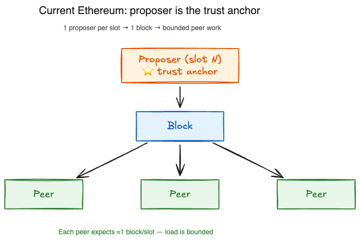
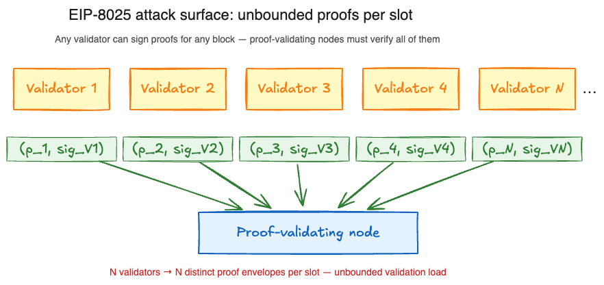
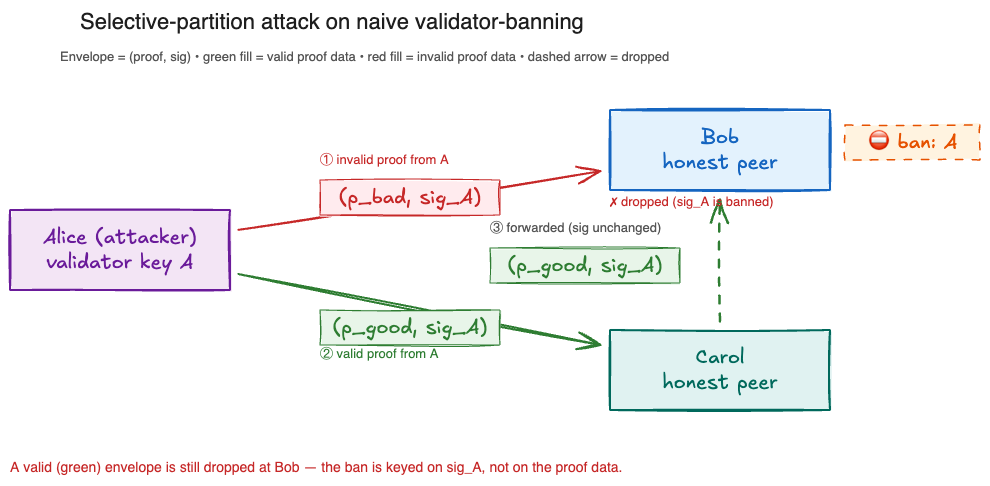
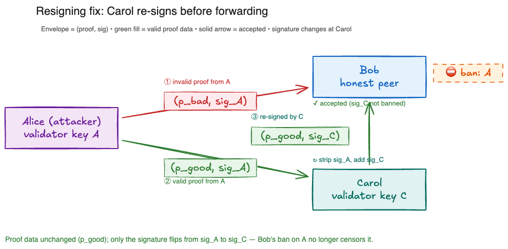

# EIP-8025: The Missing Trust Anchor for Proof Load

> **Status:** draft for discussion
> **Related:** [consensus-specs#5055](https://github.com/ethereum/consensus-specs/pull/5055)
> **Author:** Frankie (`@frisitano`)

---

## TL;DR

Current Ethereum has an implicit **trust anchor** — a single proposer per slot — that bounds how much *block*-validation work a peer can be forced to do per slot. EIP-8025 introduces optional execution proofs and anchors them via **validator signatures** (each proof is stake-bound to a validator key). The open question this doc raises is whether that is sufficient: because **any** validator can sign **any** proof, there is no equivalent per-slot cap on proofs, and an attacker with multiple validators can amplify proof-validation load at will — creating a denial-of-service vector against proof-verifying nodes.

This doc frames the problem, lays out two candidate answers — **p2p peer-level banning** and **validator-level banning** — and argues that the key open question is whether peer-layer banning alone is *sufficient*.

---

## Terminology

- **Trust anchor** — an in-protocol mechanism that bounds a per-slot quantity by tying it to a stake-bound, rate-limited choke point.
- **Proof validating node** — a validator that opts into validating execution proofs.
- **Resigning** — replacing the signature carried with a gossiped proof so that the propagating validator, not the original signer, is accountable for what they forwarded.

---

## 1. Background: the implicit trust anchor

In the current Ethereum protocol:

- Each slot has **exactly one** designated proposer.
- Honest nodes only accept blocks from that proposer for the slot.
- Therefore, the number of distinct blocks a peer expects to process per slot is bounded at ≈1 (with occasional forks).

The proposer selection mechanism is the trust anchor: it is *in-protocol*, it is bound to stake, and it is rate-limited by the slot schedule. Everything downstream — block validation, state transition , etc— inherits a bound from this single choke point.

> *Figure 1 — One proposer per slot → one block per slot → bounded peer work per slot.*

---

## 2. What changes under EIP-8025

EIP-8025 makes proof generation **optional**:

- Block builders are not required to produce proofs.
- Any validator may produce and sign a proof for any block.
- Proofs propagate over the p2p network and are consumed by proof validating nodes (and other interested consumers).

Critically, **there is no protocol-level constraint on how many distinct proofs exist per slot**. If the trust anchor in §1 bounded the number of *blocks*, nothing bounds the number of *proofs*.

---

## 3. The attack

An adversary with access to stake can:

1. Acquire M validators by depositing stake.
2. Use each validator to sign **invalid** proofs for blocks.
3. Gossip those invalid proofs over the p2p network.
4. Honest proof validating nodes who receive these proofs must verify them (~80-200ms each)

The attacker's cost is O(stake); the victims cost scales with proof validation time.

> *Figure 2 — N validators at the top, each producing its own envelope `(p_i, sig_Vi)` that fans into the proof-validating node. With no in-protocol cap, an attacker controlling many validators can amplify this load at will.*

---

## 4. Candidate answer A: p2p peer-level banning

**Mechanism:**
- Invalid proofs are detected at the p2p layer.
- The *peer* (not the validator) is scored down / banned.
- Attacker gains no persistent ability to force work; they can churn peer identities but not validator stake.

**Argument for sufficiency:**
- Peer-level banning is already the standard tool for gossip-layer abuse.
- No new consensus-layer machinery is needed.
- Validator-level accountability is heavier than the problem calls for.

**Open question this leaves:**
- Can an attacker with M validators produce invalid proofs faster than peer-banning can propagate identity bans? If peer identity is cheap to rotate but *validator-to-peer* binding is not enforced, the attacker may simply rotate peer identities while continuing to abuse validator signatures.

---

## 5. Candidate answer B: validator-level banning

**Mechanism.** If a validator signs an invalid proof, peers ignore further proofs signed by that validator key (possibly with time-based expiry). Attacker cost now scales with invalid proofs issued — each validator burns its key after one.

**Problem — partition via selective gossip.** Because banning keys off the *original* signature, an attacker can weaponise it: Alice sends `(p_bad, sig_A)` to Bob (Bob bans key A), then `(p_good, sig_A)` to Carol; when Carol forwards Alice's valid envelope to Bob, Bob drops it — `sig_A` is banned. One invalid proof has censored a valid one, and scaled up this partitions which honest peers see which valid proofs.

> *Figure 3 — Alice sends `(p_bad, sig_A)` to Bob (invalid, red envelope) and `(p_good, sig_A)` to Carol (valid, green envelope). When Carol forwards `(p_good, sig_A)` to Bob, Bob drops it: the ban is keyed on `sig_A`, not on the proof data.*

**Proposed fix — resigning at each hop.** Each forwarding validator replaces the signature on the gossiped envelope with their own before forwarding. Bob evaluates the proof against *Carol's* signature, not Alice's, so a ban on the originator cannot suppress valid content an honest validator chose to forward. Accountability follows the last signer, and validators stake their own key on what they re-sign.

> *Figure 4 — Same scenario with resigning. Carol strips `sig_A` and adds `sig_C`, so the envelope Bob receives is `(p_good, sig_C)`. Proof data is unchanged; only the signature flips, and Bob's ban on key A no longer censors it.*

**Open questions:**
- Protocol complexity cost.
- Per-hop latency and bandwidth overhead.
- Net effect on signature-verification load vs the DoS surface it closes.

---

## 6. Future context: mandatory proofs restore the trust anchor

Under **mandatory proofs**, proof generation moves into the block-building pipeline itself: the builder constructing a block for a given slot is also responsible for producing its execution proof. With exactly one builder per slot, the **builder key becomes the trust anchor** — analogous to how the single proposer bounds blocks per slot today. Honest nodes accept only proofs signed by the slot's builder key, and the number of proofs a peer expects to attempt to verify per slot collapses back to O(1).

The DoS surface described in §3 therefore exists **only while EIP-8025 is optional**. It dissolves naturally once proofs are mandatory: without the ability for an arbitrary validator to sign a proof for any block, the attacker can no longer amplify verification load. Both candidate answers — peer-level banning (§4) and validator-level banning (§5) — should be read as **transitional mechanisms** that buy time between the optional-proof rollout and mandatory proofs, not as long-term protocol additions.
