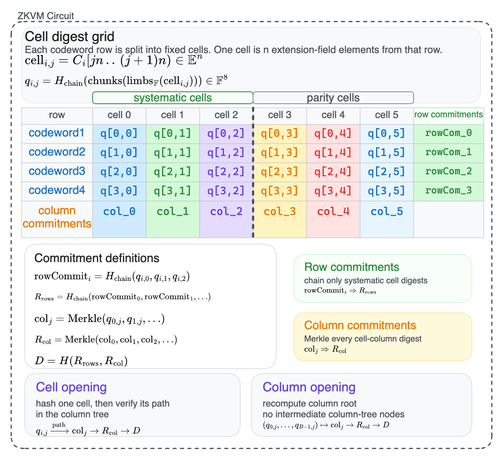
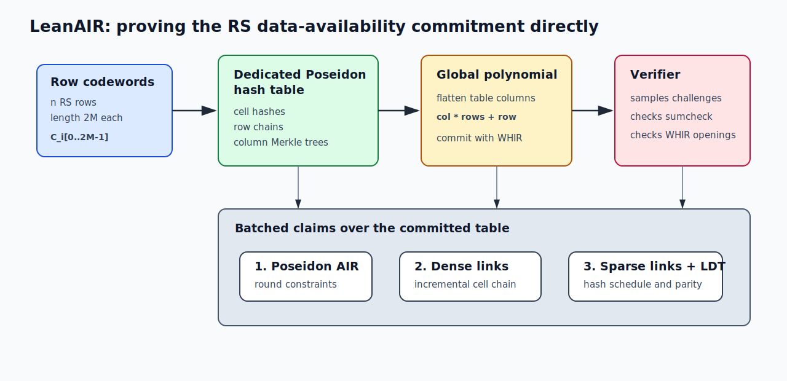
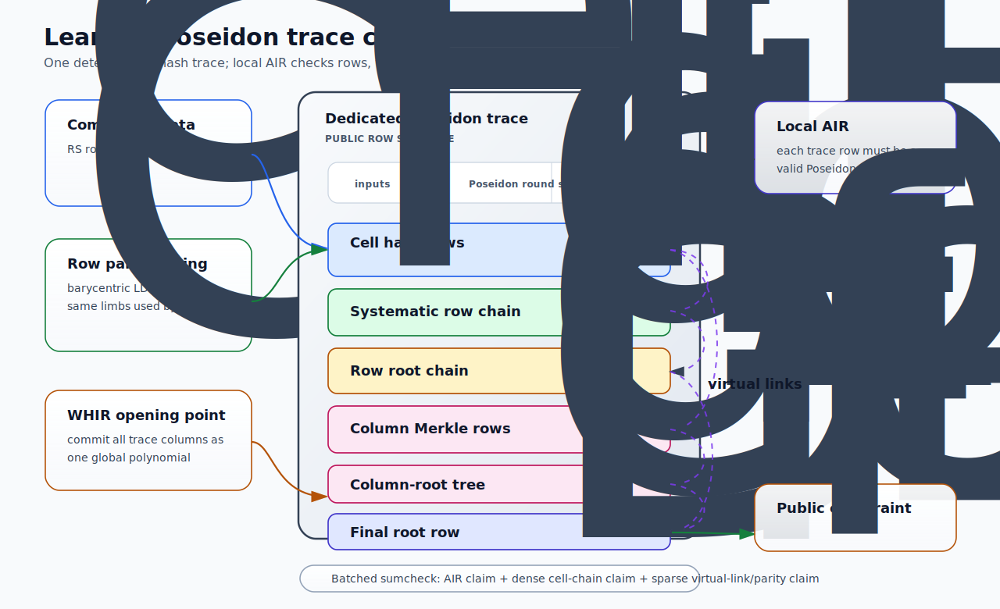
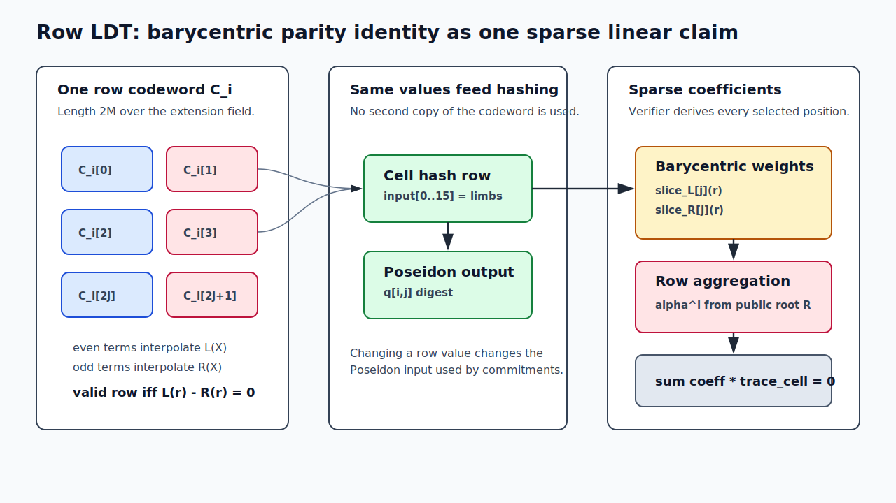

# Post Quantum Proofs of Reed-Solomon Codes with LeanAIR

> **Status:** research writeup
> **Code:** `crates/lean-air`
> **Implementation:** [`frisitano/leanMultisig@232308f2`](https://github.com/frisitano/leanMultisig/tree/232308f2711ee742cada68cca91aa93dfe379655/crates/lean-air)
> **Author:** Tau Lepton

---

## TL;DR

LeanAIR evaluates a direct prover for a post-quantum Reed-Solomon data-availability commitment. On a 192-vCPU Graviton4 instance, the LeanAIR single-proof measurement is about **7.5 MiB/s**, compared with the available single-proof `lean-da` measurements of **1.37 MiB/s** for the LeanVM baseline parity check and **1.19 MiB/s** for the LeanVM column-commit parity check. LeanAIR also reaches about **25 MiB/s aggregate proving throughput** using parallel batching, but parallelized `lean-da` proof generation was not measured here. The prover is organized around the commitment-level operations:

1. hash each fixed-size codeword cell;
2. chain systematic cell digests into row commitments;
3. Merkle-commit the cell columns;
4. bind row and column roots into one public commitment;
5. prove each row is a Reed-Solomon codeword using the barycentric parity identity.



The resulting proof uses a dedicated Poseidon table, WHIR openings of that table, and two families of virtual linear consistency claims. The row low-degree test is expressed as a sparse linear claim over the same committed trace columns that feed the cell hashes, so the values checked for Reed-Solomon validity are exactly the values committed by the cell and column commitments.

---

## 1. The Experiment

The earlier implementation used a LeanVM program:

- it witnesses row codewords;
- calls Poseidon precompiles for cell hashes and commitments;
- computes barycentric row checks inside VM execution;
- proves the whole VM trace.

In that implementation, the proof statement includes general VM execution components in addition to the commitment-specific computation:

- instruction decoding;
- bytecode accumulation;
- memory indirection;
- generic precompile request routing;
- repeated extension arithmetic through the VM execution model.

LeanAIR keeps the same proof backend family, field stack, Poseidon permutation, WHIR PCS, and Fiat-Shamir transcript shape, but removes the VM layer. The witness is lowered directly into a dedicated table whose rows are Poseidon16 compressions and whose columns are the Poseidon round witnesses.

The design represents the cryptographic and coding-theoretic work directly in the proof trace. Once the table layout is public, the proof can be organized around three ingredients: local Poseidon constraints, global linear wiring constraints, and a Reed-Solomon row check.



The current implementation is centered on:

```text
crates/lean-air/src/hash_table.rs
crates/lean-air/src/proof.rs
```

The command-line benchmark entry point is:

```text
crates/lean-air/src/main.rs
```

---

## 2. Commitment Shape


LeanAIR proves the commitment shape shown above. Each Reed-Solomon row is split into fixed cells, each cell is hashed into the digest grid entry `q[i,j]`, and only the systematic cell digests feed the row commitments `rowCommit_i -> R_rows`.

Column commitments are built over every cell-digest column, giving `col_j -> R_col`. The public commitment is the final binding `D = H(R_rows, R_col)`. A cell opening verifies one cell through its column-tree path, while a column opening recomputes the column root from the full opened digest column.

---

## 3. Trace, WHIR, and Virtual Claims

LeanAIR proves the diagrammed commitment by lowering every required hash into one deterministic Poseidon16 trace. The AIR constrains each hash row as a valid Poseidon compression, WHIR commits to the resulting trace columns, and sumcheck enforces the non-local wiring that connects cell digests into row commitments, column Merkle roots, the final commitment `D`, and the Reed-Solomon row check.

The public row schedule is fixed by the commitment shape:

| section | meaning | row count |
|---|---|---:|
| `Cell` | hash every row cell, including incremental chunks | `n_rows * num_cells * chunks_per_cell` |
| `SystematicRow` | chain systematic cell digests into each row digest | `n_rows * num_systematic_cells` |
| `RowRoot` | chain row digests into `R_rows` | `n_rows` |
| `ColumnMerkle` | Merkle tree per cell column | `num_cells * (padded_rows - 1)` |
| `ColumnRoot` | Merkle tree over column roots | `num_cells - 1` |
| `FinalRoot` | bind row and column roots into `D` | `1` |



The committed table columns are flattened into one global multilinear polynomial:

```text
global[column * padded_rows + row] = trace[column][row]
```

WHIR commits to this polynomial. The verifier samples a row-domain point, receives all column evaluations at that point, and checks one batched claim:

1. local Poseidon AIR constraints;
2. dense cell-chain links;
3. sparse virtual linear constraints for schedule wiring and row parity.

```text
claim = AIR_claim + eta * cell_link_claim + eta^2 * sparse_linear_claim
```

The dense links cover incremental cell hashes:

```text
output(prev_chunk)[limb] = input(next_chunk)[limb]
```

The sparse links cover the public hash schedule:

- systematic row digests read cell hash outputs;
- row-root rows read row digest outputs;
- column Merkle parents read child digest outputs;
- the column-root tree reads column roots;
- the final root reads `R_rows` and `R_col`.

The row low-degree test is another sparse linear identity over the same committed columns. For each row codeword `C_i`, let `w` be a primitive `2M`-th root of unity and `u = w^2`. The even and odd halves define:

```text
L_i(X): interpolates {(u^j,       C_i[2j])}
R_i(X): interpolates {(w * u^j,   C_i[2j+1])}
```

A valid row satisfies `L_i(X) = R_i(X)`. At a verifier challenge `r`, the barycentric form is:

```text
sum_j slice_L[j](r) * C_i[2j]  -  sum_j slice_R[j](r) * C_i[2j+1] = 0
```

with:

```text
slice_L[j](r) =  (r^M - 1) / (r * u^{-j} - 1)
slice_R[j](r) = -(r^M + 1) / (r * w^{-1} * u^{-j} - 1)
```

LeanAIR aggregates all rows using a challenge derived from the public commitment:

```text
alpha = Poseidon16("LEANAIR row alpha" || log_m || n_rows || cell_len_ext || D)

sum_i alpha^i * (
    sum_j slice_L[j](r) * C_i[2j]
  - sum_j slice_R[j](r) * C_i[2j+1]
) = 0
```

The binding detail is that this parity identity does not read a separate codeword witness. The implementation maps each codeword limb:

```text
C_i[t].limb_k
```

to the exact `(trace_row, input_column)` where that limb is absorbed by the `Cell` hash row. The parity check therefore reads the same values that are hashed into cell digests, then chained into row roots and column Merkle roots.



The sparse schedule and parity checks are combined as:

```text
sparse_linear_claim =
    parity_claim + link_mix * hash_link_claim
```

This gives lookup-like binding without a generic logup or VM memory table. The schedule is public, so both prover and verifier derive the linear coefficients from public shape and transcript challenges. The values being checked are WHIR-committed trace columns.

This representation does not include:

- a separate lookup table;
- memory index columns;
- table-inclusion checks for every cell and digest edge.

This is a specialized representation for a fixed public schedule rather than a general lookup system.

---

## 4. Minimal Proving Machinery

The proof has three layers.

### 4.1 Poseidon permutation constraints

The `LeanAirDedicatedHashAir` table constrains each row to be a valid Poseidon16 compression:

```text
input[16] -> Poseidon1-16 -> output[8]
```

It stores enough intermediate round state to keep constraints low degree:

- beginning full-round post-states;
- partial-round first-lane values;
- ending full-round post-states;
- final output limbs.

The partial-round block uses the backend low-degree AIR path:

```text
low_degree_air() = Some((3, DEDICATED_HASH_PARTIAL_ROUNDS))
```

This keeps the partial-round constraints at degree 3 inside the AIR sumcheck.

### 4.2 Public root constraints

The final row of the Poseidon schedule must output the public commitment:

```text
trace[output_limb][final_row] = D[limb]
```

These are passed to WHIR as `SparseStatement::unique_value(...)` constraints.

### 4.3 Virtual linear schedule constraints

The schedule constraints are not local AIR transitions. They are global linear identities over the committed columns:

```text
source_digest_limb - sink_input_limb = 0
zero_padding_limb = 0
parity_weighted_codeword_limb_sum = 0
```

They are proved by the dense and sparse `OuterSumcheckSession`s and then tied back to WHIR openings at the sumcheck point.

The split is:

- Poseidon arithmetic is local and belongs in AIR;
- deterministic schedule wiring is global and represented as a virtual linear claim;
- row low-degree testing is naturally a global linear identity.

---

## 5. Benchmark Snapshot

The latest Graviton runs give the current performance shape.

| machine | vCPU | highest observed aggregate wall throughput | highest observed aggregate prove throughput |
|---|---:|---:|---:|
| c8g.16xlarge | 64 | 12,774 KiB/s | 13,692 KiB/s |
| c8g.48xlarge | 192 | 25,117 KiB/s | 27,020 KiB/s |

At the matching `101` row/blob payload on the 48xlarge, the available measurements cover different execution modes:

| measured configuration | execution mode | throughput |
|---|---|---:|
| LeanVM baseline parity check | single proof | 1,370 KiB/s |
| LeanVM column-commit parity check | single proof | 1,186 KiB/s |
| LeanAIR direct prover | single proof | ~7.5 MiB/s |
| LeanAIR highest-throughput batch | parallel batch | 25,117 KiB/s |

The LeanAIR aggregate result uses parallel batching across independent proofs. Parallelized `lean-da` proof generation was not measured here, so the table reports the observed configurations rather than an intrinsic speedup ratio between the two implementations. The LeanAIR single-proof value is recorded as approximate because the exact run artifact is not present in the local repo.

---

## 6. Commands

Single proof:

```sh
target/release/lean-air \
  --log-m 13 \
  --n-rows 101 \
  --cell-len-ext 512 \
  --prove \
  --runs 5 \
  --table
```

48xlarge batch shape used for highest wall throughput:

```sh
target/release/lean-air bench-parallel \
  --log-m 13 \
  --n-rows 101 \
  --cell-len-ext 128 \
  --concurrency 32 \
  --rayon-threads 6 \
  --runs-per-worker 3 \
  --pin
```

LeanVM parity-check comparisons:

```sh
target/release/lean-da --n-blobs 101 --construction baseline
target/release/lean-da --n-blobs 101 --construction column-commit
```
