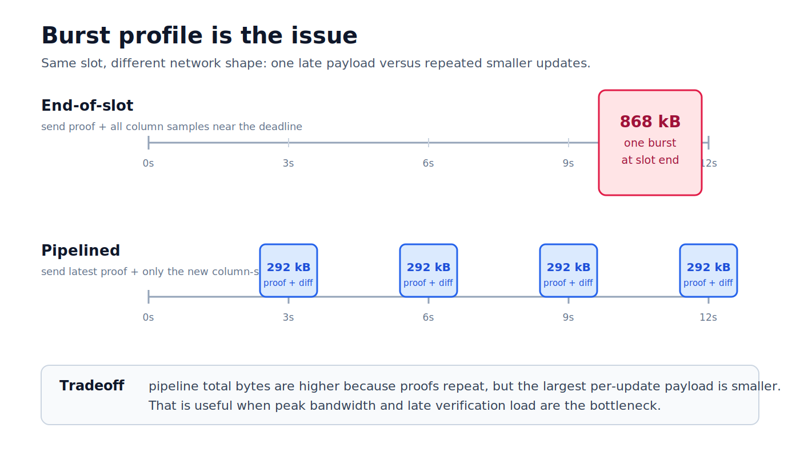
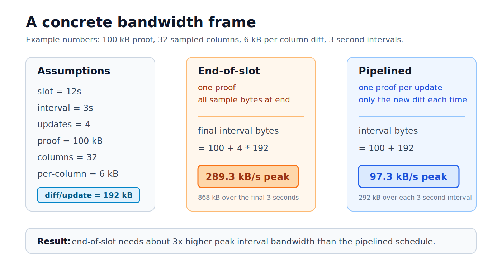

# Pipelined PQ blob dissemination

> **Status:** research note
> **Related:** Ethereum DAS blob proof dissemination
> **Author:** Tau Lepton

---

## 1. Problem

Proving blobs and disseminating them at the end of the slot results in a bursty network profile and increases the bandwidth requirements for validators and builders.

Pipelining changes the shape of the same work. A node periodically broadcasts the latest proof for the covered blob set and only the new column-sample diff since the previous broadcast. Peers that already saw earlier updates do not need the old samples again.

For this note, assume two primitives:

- a proof that binds the covered blob cells to a valid data-availability statement;
- a column sample that is committed to with a commitment that is incrementally updatable, such as a Merkle tree.

The question is therefore a bandwidth-shaping question:

```text
Do we prefer one low-overhead burst at the end,
or repeated proof overhead in exchange for smaller bursts during the slot?
```



---

## 2. Bandwidth Analysis

Use a concrete example, not as a parameter recommendation, but as a way to reason about the tradeoff. The analysis metric is **peak interval bandwidth**:

```text
interval_bandwidth = bytes_sent_in_interval / interval_duration
peak_bandwidth     = max(interval_bandwidth over the slot)
```

This is the resource requirement a node must provision for. Total bytes still matter, but a protocol that sends fewer bytes overall can still be harder to run if those bytes all arrive in one short interval.

Assume:

```text
slot_duration             = 12 seconds
update_interval           = 3 seconds
updates_per_slot          = 4
proof_bytes               = 100 kB
sampled_columns_per_update = 32
bytes_per_column_sample   = 6 kB
```

Each pipelined update carries:

```text
column_diff_bytes = sampled_columns_per_update * bytes_per_column_sample
                  = 32 * 6 kB
                  = 192 kB

pipelined_update_bytes = proof_bytes + column_diff_bytes
                       = 100 kB + 192 kB
                       = 292 kB
```

The full slot contains:

```text
total_column_sample_bytes = updates_per_slot * column_diff_bytes
                          = 4 * 192 kB
                          = 768 kB
```

The two dissemination strategies send the same `768 kB` of column samples. They differ in when those bytes are sent and how many proofs are repeated.

End-of-slot sends one proof plus all samples in the final interval:

```text
end_of_slot_total_bytes = proof_bytes + total_column_sample_bytes
                         = 100 kB + 768 kB
                         = 868 kB
```

Pipelining sends one proof plus one column-sample diff in each interval:

```text
pipelined_total_bytes = updates_per_slot * pipelined_update_bytes
                      = 4 * 292 kB
                      = 1,168 kB
```

So this example pays:

```text
extra_total_bytes = pipelined_total_bytes - end_of_slot_total_bytes
                  = 300 kB
```

That extra `300 kB` is exactly the three additional proof broadcasts:

```text
extra_total_bytes = (updates_per_slot - 1) * proof_bytes
                  = 3 * 100 kB
```

The total-byte cost is higher for the pipeline, but the bandwidth requirement is lower because the bytes are spread across the slot.

### Per-Interval Bandwidth

Divide the slot into four `3 second` intervals. The average bandwidth required inside each interval is:



```text
interval_bandwidth = interval_bytes / 3 seconds
```

| interval | end-of-slot bytes | end-of-slot bandwidth | pipelined bytes | pipelined bandwidth |
|---|---:|---:|---:|---:|
| 0-3s | 0 kB | 0 kB/s | 292 kB | 97.3 kB/s |
| 3-6s | 0 kB | 0 kB/s | 292 kB | 97.3 kB/s |
| 6-9s | 0 kB | 0 kB/s | 292 kB | 97.3 kB/s |
| 9-12s | 868 kB | 289.3 kB/s | 292 kB | 97.3 kB/s |

So the peak bandwidth requirement is:

```text
end_of_slot_peak_bandwidth = 868 kB / 3 s = 289.3 kB/s
pipelined_peak_bandwidth   = 292 kB / 3 s = 97.3 kB/s
```

In this example, end-of-slot dissemination uses fewer total bytes:

```text
end_of_slot_total_bytes = 868 kB
pipelined_total_bytes   = 1,168 kB
```

But end-of-slot dissemination is more resource intensive at the critical moment:

```text
end_of_slot_peak_bandwidth / pipelined_peak_bandwidth
  = 289.3 / 97.3
  ~= 3x
```

This is the main argument for pipelining. It is not a total-byte optimization; it is a peak-bandwidth optimization. It pays repeated proof bytes to avoid a large final-quarter bandwidth spike.

The rule of thumb is:

```text
Pipelining helps when lower peak bandwidth is worth
the repeated proof-byte overhead.
```

If blobs arrive evenly and column-sample bytes dominate proof bytes, pipelining smooths the network profile. If proof bytes dominate, or if an adversary withholds most blobs until the last interval, the smoothing benefit shrinks.
